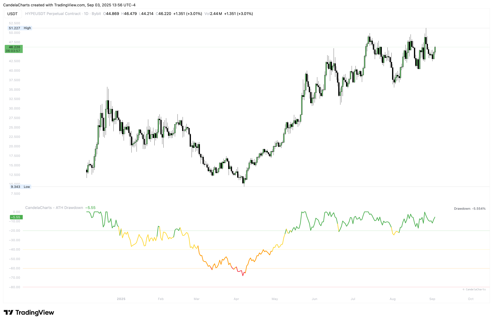

# Usage

<figure><figcaption></figcaption></figure>

The indicator computes ATH from the first bar in view—then choose whether ATH should reference Close (more conservative) or High (includes wicks). Keep the study in its own pane (overlay = false) for a clean read.

If you prefer a smoother curve, apply a small EMA length to the drawdown percentage (for example 3–8) to emphasize regime shifts; set smoothing to 0 to view the raw series. Turn on the gridlines at −20%, −40%, −60%, and −80% to create intuitive risk bands, and use the built-in table to monitor the latest drawdown value at a glance.

To get proactive signals, enable the “Alert 70–80%” option and create an alert on the condition “Drawdown between 70% and 80%,” set to Once per bar close on your anchor timeframe. If notifications feel noisy, step up the timeframe or add a touch more smoothing; the default alert message is “ATH Drawdown is between 70% and 80%.”

For practical workflows, treat weekly or daily charts with light smoothing as a cycle map (near 0% suggests late expansion; below −60% reflects deep retrace); build DCA ladders by committing to accumulate below a chosen band (e.g., −60%) and overweight near capitulation (−70% to −80%); compare multiple symbols side by side to see which assets are early vs. late in their cycles; and gate reversal setups so they’re only considered once drawdown sits beneath your threshold and market structure agrees.

Note that switching symbols or loading more history can reveal an earlier or higher ATH and slightly shift the drawdown baseline; for consistency, use data sources with the most complete history available.
