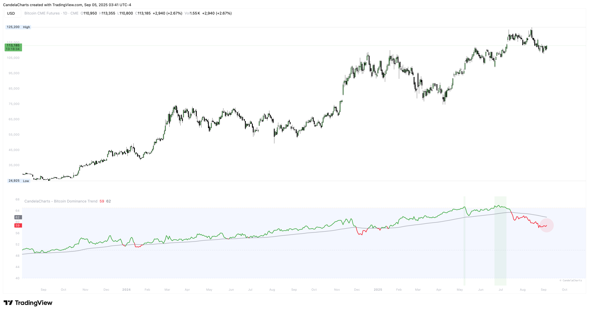

# Overview

<figure><figcaption></figcaption></figure>

Bitcoin Dominance is a key market metric that measures Bitcoin’s market capitalization relative to the entire cryptocurrency market.&#x20;

This indicator plots:

* **Daily BTC.D close values**
* **Trend-moving averages (MA)** for dominance tracking
* **Dynamic bullish/bearish color shifts** based on trend alignment
* **Critical dominance levels (40%, 50%, 65%)** with background highlighting


[features.md](features.md)



[usage.md](usage.md)



[confluences.md](confluences.md)



[faqs.md](faqs.md)


Traders can use it to gauge whether Bitcoin is outperforming or underperforming altcoins, assisting in portfolio allocation and market timing decisions.
