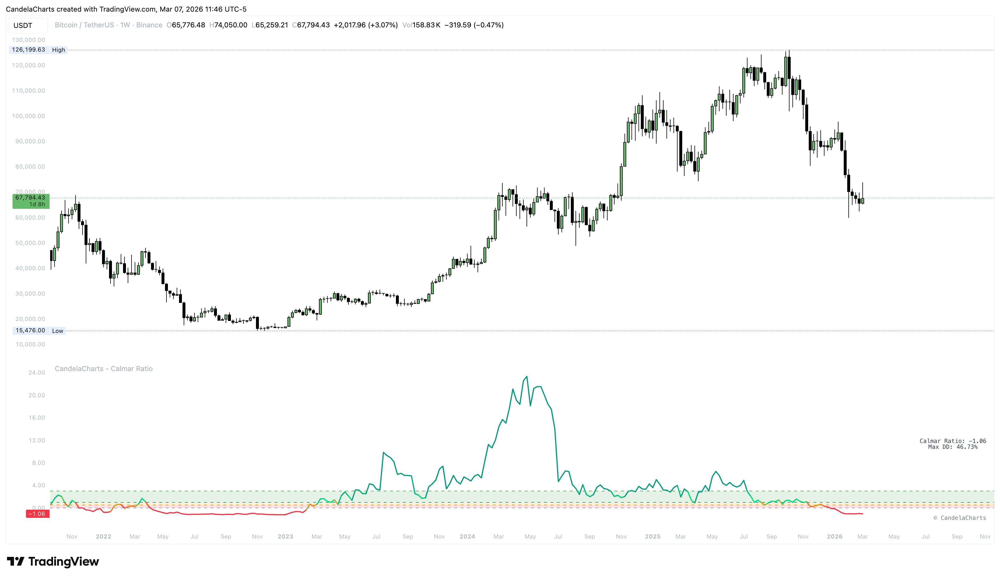

# Overview

<figure><figcaption></figcaption></figure>

The **CandelaCharts – Calmar Ratio** is a premium risk-adjusted performance metric that evaluates an asset's efficiency by comparing its Compound Annual Growth Rate (CAGR) to its Maximum Drawdown.&#x20;


[features.md](features.md)



[usage.md](usage.md)



[confluences.md](confluences.md)



[faqs.md](faqs.md)


Unlike the Sharpe Ratio, which uses volatility as the risk measure, the Calmar Ratio focuses on the "pain" of drawdowns, making it a highly practical tool for long-term investors and capital preservation strategies.
