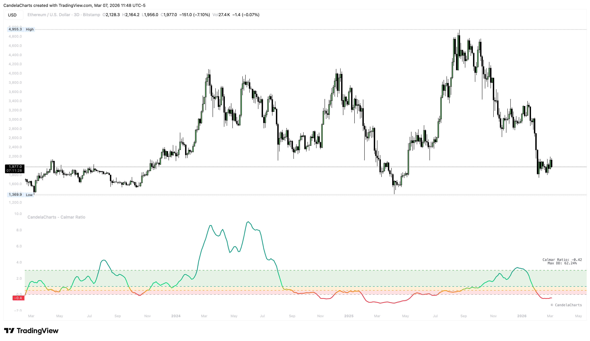

# Usage

<figure><figcaption></figcaption></figure>

Integrate the Calmar Ratio into your workflow using these practical methods for monitoring and comparing assets.

* **Assess Risk-Efficiency**: Use the ratio to determine if an asset's returns justify the drawdown risk. A ratio above 1.0 is generally considered a sign of a high-quality strategy.
* **Trend Health Check**: In a healthy trend, the Calmar Ratio should be rising or stable. A sharp drop indicates that recent drawdowns are expanding faster than returns.
* **Strategy Comparison**: Compare different symbols or strategies on the same timeframe to identify which provides the best "return per unit of pain."
* **Monitoring Pullbacks**: Watch the ratio during corrections; if a small dip causes a large drop in the ratio, the prior growth may have been fragile.

#### Suggested Settings per Trading Style

Adjust the "Lookback (Days)" setting to align the risk-efficiency calculation with your specific market participation style:

* **Scalpers (M1 - M5)**: Use a **1-Day to 3-Day** lookback. This highlights hyper-local efficiency and sensitivity to immediate market micro-structures.
* **Day Traders (M15 - H1)**: Use a **5-Day to 20-Day** lookback. This provides enough data to assess daily momentum relative to the week's drawdown.
* **Swing Traders (H4 - D1)**: Use a **60-Day to 120-Day** lookback. This filters out noise and focuses on the health of multi-week trends.
* **Long-term Investors (D1 - W1)**: Use the default **252-Day** (one trading year) or higher. This measures secular growth efficiency and capital preservation over major market cycles.
