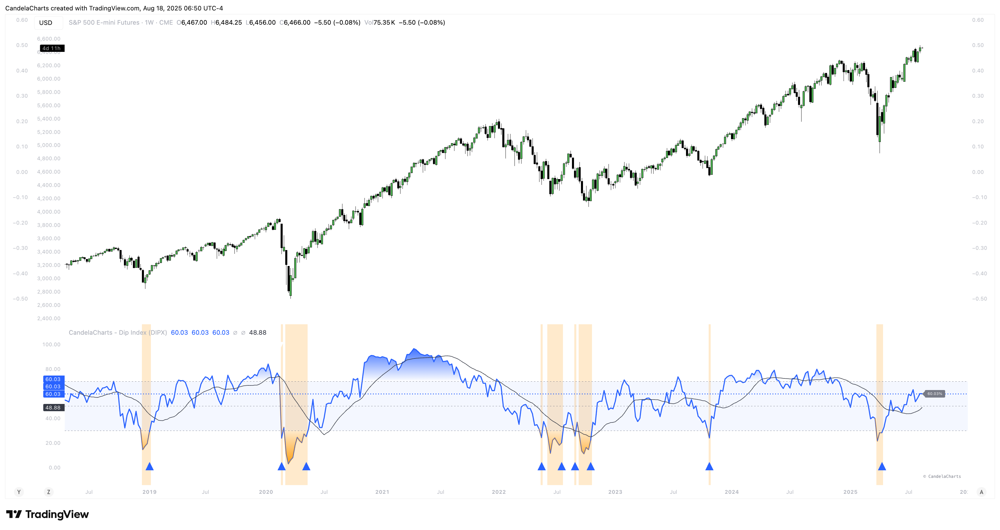

# Features

Tools like the **Dip Index (DIPX)** offer a way to assess market breadth by showing the percentage of assets trading above key moving averages—highlighting overbought or oversold conditions, spotting divergences, and signaling potential reversals.

<figure><figcaption></figcaption></figure>

These insights are not limited to a single asset class; they apply wherever trends form and sentiment shifts.

* **Markets:** Stocks & Crypto
* **Multiple Indices**: Supports SP500, Nasdaq, DJI, Russel2000, and sector-specific S\&P indices.
* **Dynamic MA Selection**: Choose from SMA, EMA, RMA, WMA, VWMA with configurable lengths.
* **Visual Customization**: Full control over colors, line styles, text size, and branding.
* **Signal Markers**: Triangle markers appear when exiting overbought/oversold zones.
* **Gradient & Background Fill**: Visual highlighting of extreme market conditions.
* **Overlay Mode Option**: Can display OB/OS background as chart overlay.
* **Smart Money:** Enables accumulation spring detection with configurable pivot length and volume threshold.
