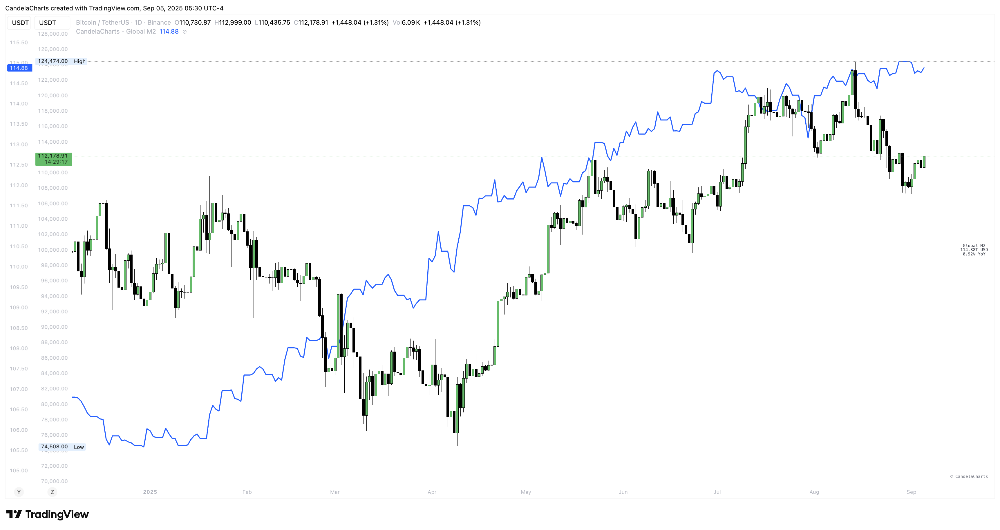

# Usage

<figure><figcaption></figcaption></figure>

Turn the aggregate into decisions by reading the slope, the YoY impulse, and the relationship to the assets you trade.

* **Cycle context:** Rising Global M2 with positive/accelerating YoY often aligns with **risk-on**; flat/declining liquidity can precede **risk-off**.
* **Asset overlay:** Compare Global M2 vs. indices (S\&P 500, NASDAQ), crypto (BTC/ETH), or commodities (Gold/Oil) to spot support or divergences.
* **Lead–lag testing:** Use **Offset (± up to 52 weeks)** to examine whether liquidity changes precede or follow your target asset on your timeframe.
* **Regional attribution:** Toggle regions to isolate the influence of key blocs (US, China, Eurozone) on the aggregate.
* **Risk calibration:** Tighten risk when YoY compresses or flips negative; consider scaling exposure when YoY re-accelerates—always with price confirmation.
