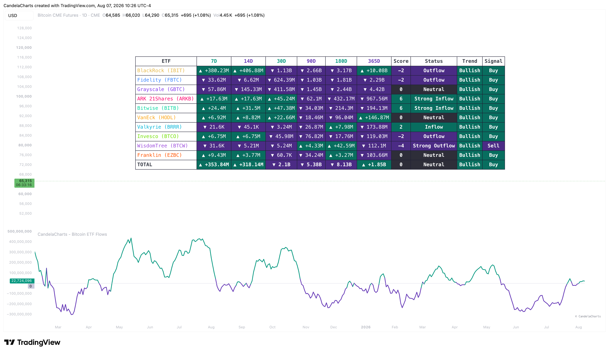

# Overview

<figure><figcaption></figcaption></figure>

This indicator aggregates and visualizes the daily balance changes across top-tier Bitcoin Spot ETFs. It provides a macro perspective on whether institutions are accumulating or distributing their holdings.


[features.md](features.md)



[usage.md](usage.md)



[confluences.md](confluences.md)



[faqs.md](faqs.md)


Instead of relying solely on price action, the Bitcoin ETF Flows indicator allows you to "follow the money." By analyzing raw inflows/outflows or calculating ETF dominance, you can determine if capital is entering the market aggressively or if large players are de-risking. The data is presented in a clean, highly customizable dashboard that supports multiple lookback periods and statistical formats.
