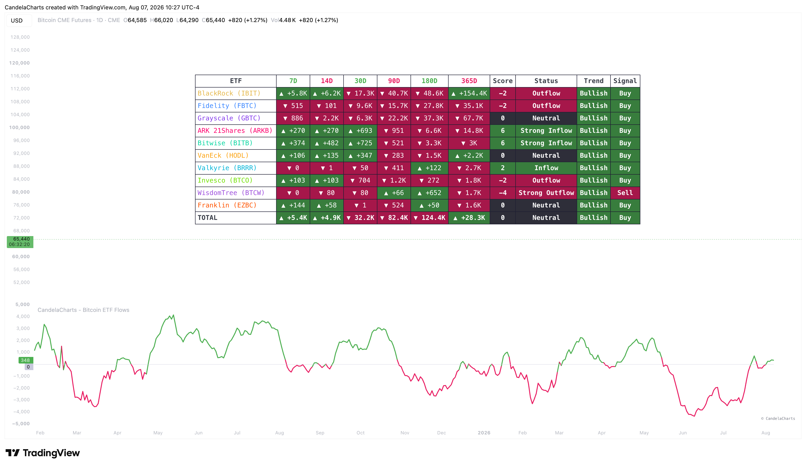

# Usage

<figure><figcaption></figcaption></figure>

The Bitcoin ETF Flows indicator is best used to determine the underlying institutional bias in the market, providing structural context for both swing trading and long-term investing.

### How it works

The indicator pulls end-of-day balance data for the selected ETFs using Glassnode metrics. Depending on your selected "Plot Mode", it either calculates the net change in balances (Inflows/Outflows) or calculates the percentage share of a specific ETF relative to the total group (Dominance). This raw data is then smoothed using a configurable SMA (Mean Length) and can be statistically normalized using a rolling Z-Score to highlight statistically significant accumulation or distribution events.

### Interpreting the Data

* **Inflows & Outflows**: Consistent net inflows indicate strong institutional accumulation, providing a bullish backdrop for Bitcoin price action. Large, sudden outflows often precede or confirm market corrections as institutions de-risk. Pay attention to Z-Scores above +2.0 or below -2.0 for highly significant flow events.
* **Dominance Mode**: Monitoring ETF Dominance (e.g., BlackRock's IBIT vs Grayscale's GBTC) helps identify the "leaders" of the ETF space. A rising dominance in newer ETFs alongside a declining dominance in legacy funds (like GBTC) often highlights a structural rotation of capital rather than outright market distribution.
* **Using the Dashboard**: The built-in dashboard provides a quick snapshot across multiple horizons (7D to 365D). Green highlights indicate positive flows/growth, while red indicates negative flows/contraction. Aligning short-term flows (7D/14D) with long-term trends (90D+) provides the highest probability context.
