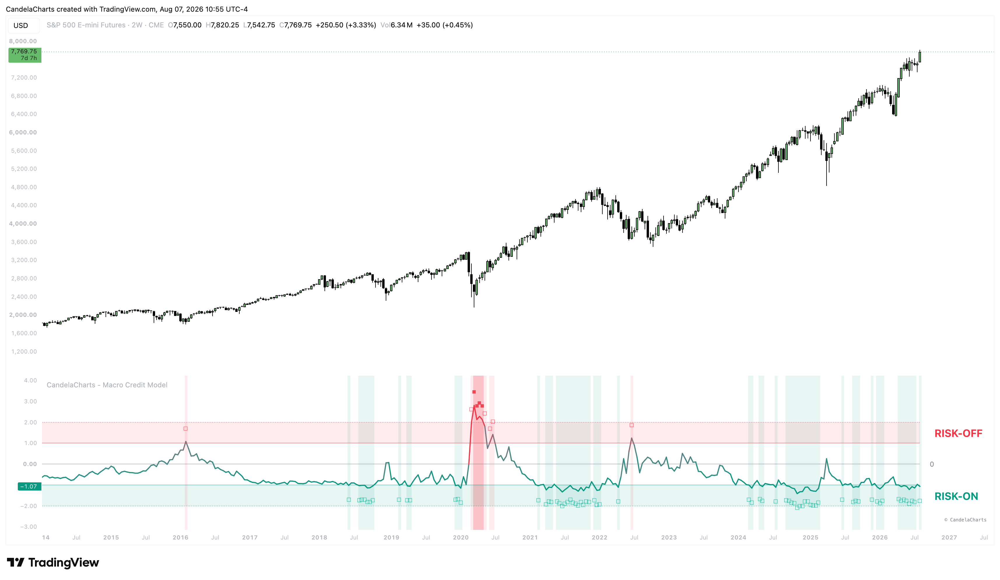

# Overview

<figure><figcaption></figcaption></figure>

The Macro Credit Model evaluates the ICE BofA Option-Adjusted Spreads (OAS) directly from the Federal Reserve Economic Data (FRED) database. It tracks either the absolute High Yield spread or the "Excess Spread" (High Yield minus Investment Grade).


[features.md](features.md)



[usage.md](usage.md)



[confluences.md](confluences.md)



[faqs.md](faqs.md)


Instead of looking at the raw spread values, the indicator computes a rolling statistical Z-Score to normalize the data across different market environments. When the Z-Score spikes into "Stress" territory, it signifies that credit conditions are deteriorating rapidly (a strong "Risk-Off" signal). Conversely, when spreads are tight and Z-Scores drop into "Extreme Low" territory, it indicates a healthy, accommodating credit environment ("Risk-On").
