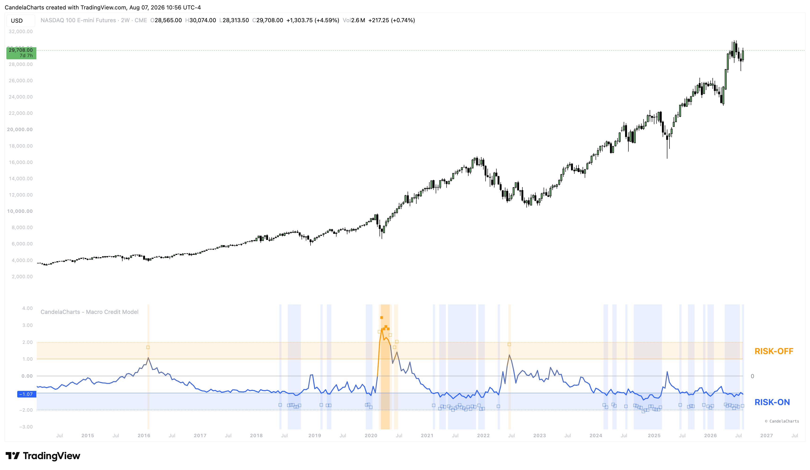

# Usage

<figure><figcaption></figcaption></figure>

The Macro Credit Model is a structural compass. It is best used as a macro filter to decide how aggressive or defensive your overall portfolio positioning should be.

### How it works

The indicator pulls daily closing data from FRED for High Yield (BAMLH0A0HYM2) and Investment Grade (BAMLC0A0CM) bond spreads. It calculates the spread differential, smooths it via an EMA, and then normalizes it using a rolling Z-Score. By comparing this Z-Score against predefined standard deviation thresholds (e.g., +2.0 for Stress, -2.0 for Extreme Low), the model objectively classifies the current macroeconomic regime.

### Interpreting the Regimes

* **Stress Zone (Risk-Off)**: When the Z-Score breaks above the +2.0 threshold (Top Zone Highlight), credit markets are panicking. Liquidity is drying up, and default risks are being aggressively priced in. This is a massive red flag for equities and typically precedes deep market drawdowns. You should aggressively de-risk.
* **Elevated Zone**: A Z-Score between +1.0 and +2.0 suggests caution. Credit conditions are worsening, signaling a potential late-cycle environment.
* **Low Risk Zone (Risk-On)**: When the Z-Score drops into negative territory, investors are confidently buying risky corporate debt. This confirms a healthy macroeconomic backdrop, heavily supporting long positions in equities and risk assets.
* **Extreme Low Zone**: A Z-Score below -2.0 signifies euphoric credit conditions. While this is highly bullish in the short term, it can occasionally signal a late-stage bubble where risk is not being properly priced.

### Important Note on Timeframes

Because FRED reports this data at the end of the day, **this indicator requires a 1D timeframe or higher** to function correctly.
