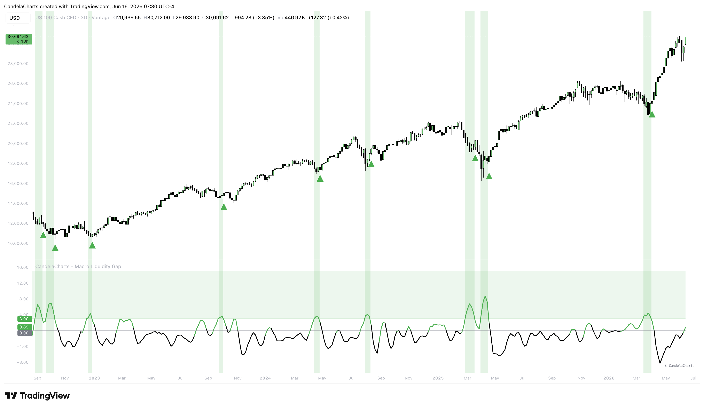

# Overview

This indicator tracks the divergence between global M2 money supply and global asset prices.&#x20;

<figure><figcaption></figcaption></figure>

It dynamically tracks liquidity from 8 major central banks (US, China, Eurozone, Japan, UK, Canada, Switzerland, and India), converts it to USD, and compares the growth against a user-defined market index.&#x20;


[features.md](features.md)



[usage.md](usage.md)



[confluences.md](confluences.md)



[faqs.md](faqs.md)


It is designed to find deep value "Buy Zones" where asset prices have dropped significantly below what global liquidity data supports, giving macro investors a significant edge.
