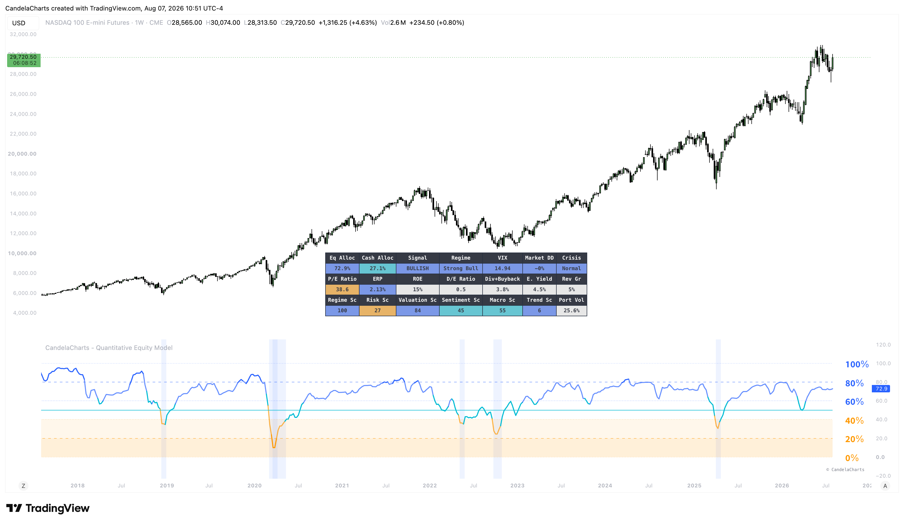

# Overview

<figure><figcaption></figcaption></figure>

The Quantitative Equity Model evaluates the market through a comprehensive Five-Pillar Framework: Market Regime, Risk Metrics, Valuation, Sentiment, and Macroeconomic conditions.


[features.md](features.md)



[usage.md](usage.md)



[confluences.md](confluences.md)



[faqs.md](faqs.md)


By analyzing these pillars concurrently, it removes emotion from the investment process. Instead of guessing when to buy or sell, the model provides a mathematical output for your optimal equity exposure. It features an automated crisis detection engine that overrides standard allocations during extreme market stress, instantly de-risking your portfolio to cash or safe havens to protect capital.
