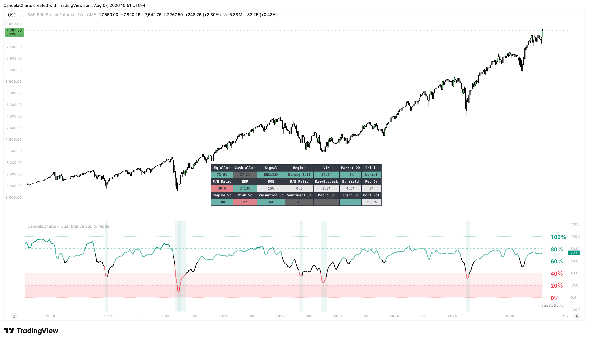

# Usage

<figure><figcaption></figcaption></figure>

This quantitative model is built to automate and inform top-down asset allocation decisions for medium to long-term investors.

### How it works

The model aggregates data across five distinct pillars: Market Regime (trend and drawdowns), Risk Metrics (volatility targeting), Valuation (fundamentals like Forward P/E and Yields), Sentiment (market breadth), and Macro (yield curves and credit spreads). These pillars are weighted and combined to produce a baseline equity allocation percentage. If hard-coded crisis thresholds (like an extreme VIX spike) are breached, an automated crisis engine overrides the standard math to rapidly cut exposure. Finally, the allocation is adjusted based on your custom target volatility and max drawdown constraints.

### Interpreting the Allocation

* **De-Risking (0-40%)**: When the allocation line drops sharply into the lower bounds, the model has detected severe market stress. This is a signal to aggressively reduce equity exposure and move capital into cash or safe-haven bonds.
* **Re-Allocating (80-100%)**: When the allocation is pinned near 80-100%, conditions are highly favorable for risk-on assets. It suggests that valuation, macro conditions, and market sentiment support being fully invested.
* **Finding Generational Bottoms**: The Buy Zone backgrounds visually identify periods of extreme fear. When the market is in a deep crisis and the model reads an allocation near 0%, these periods often represent the best long-term accumulation zones for equities.
* **Identifying Extremes**: An allocation pinned near 100% for extended periods may suggest the market is broadly overbought and susceptible to a pullback, while 0% highlights deeply oversold capitulation.
