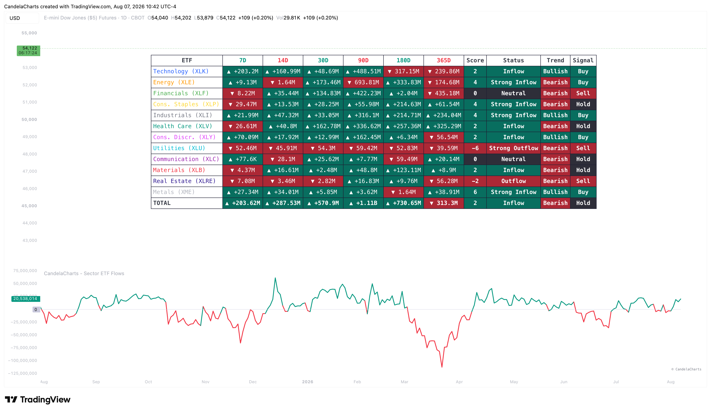

# Overview

<figure><figcaption></figcaption></figure>

The Sector ETF Flows indicator aggregates and visualizes balance changes across the primary SPDR Sector ETFs (plus XME for Metals and Mining).


[features.md](features.md)



[usage.md](usage.md)



[confluences.md](confluences.md)



[faqs.md](faqs.md)


Market cycles are often defined by capital rotation—money flowing out of defensive sectors and into aggressive growth sectors (or vice versa). This indicator helps you visualize these rotations in real-time. By analyzing either absolute money flows or relative sector dominance, you can determine the underlying strength of the broader market and align your portfolio with the sectors that are actively attracting capital.
