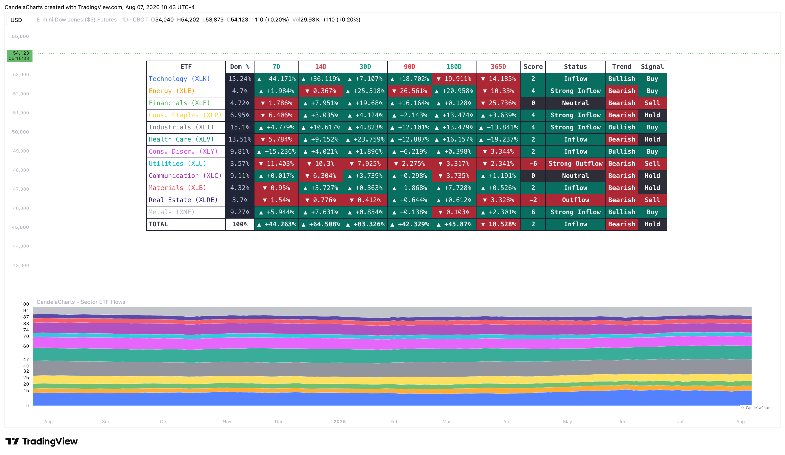

# Usage

<figure><figcaption></figcaption></figure>

The Sector ETF Flows indicator is best used to identify macro market trends and sector leadership, helping you decide where to allocate capital for the highest probability of success.

### How it works

The indicator calculates the end-of-day balance changes for the selected sector ETFs. Depending on the chosen "Plot Mode", it either displays the net dollar change (Inflows/Outflows) or calculates the percentage share of a specific sector relative to the total group (Dominance). This raw data is then smoothed using a configurable SMA (Mean Length) and can be statistically normalized using a rolling Z-Score to highlight significant accumulation or distribution events.

### Interpreting the Data

* **Inflows & Outflows**: Consistent net inflows into growth sectors (like Technology and Consumer Discretionary) indicate a strong "risk-on" environment. Large outflows from these sectors combined with inflows into defensive sectors (like Utilities and Staples) signal a "risk-off" rotation and potential broader market weakness.
* **Dominance Mode**: Monitoring Sector Dominance helps identify leadership. A rising dominance in Financials and Industrials often accompanies an early-cycle economic recovery, while rising dominance in Technology suggests late-cycle momentum.
* **Using the Dashboard**: The dashboard provides a quick snapshot across multiple timeframes (7D to 365D). Green highlights indicate positive flows, while red indicates negative flows. Look for sectors that are turning green on the short-term (7D/14D) while already possessing strong long-term (90D+) inflows to find high-momentum trends.
