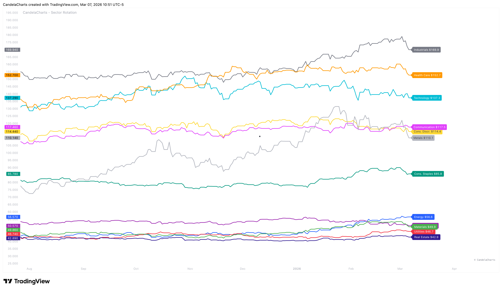

# Usage

<figure><figcaption></figcaption></figure>

To get the most out of this tool, follow these strategic guidelines for identifying and acting on sector trends.

* **Identify Leadership**: Look for sectors in the **Leading** phase with high Relative Volume (RV) to confirm institutional conviction.
* **Early Cycle Plays**: Watch for Technology (XLK) and Consumer Discretionary (XLY) to enter the **Leading** phase as economic conditions shift from Recession to Early Recovery.
* **Defensive Rotation**: If Utilities (XLU) and Consumer Staples (XLP) begin **Improving** while growth sectors fade, it may signal a transition into a Recessionary phase.
* **Momentum Trading**: Focus on sectors that are both in the **Leading** phase and show increasing Relative Strength values.
