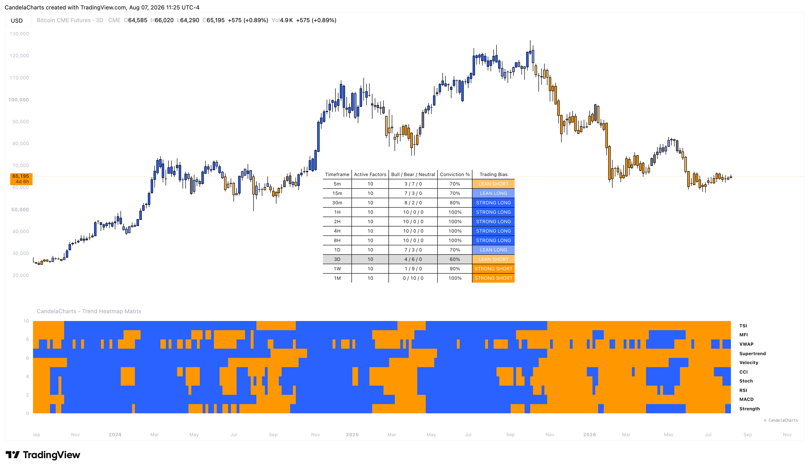

# Overview

<figure><figcaption></figcaption></figure>

Trading in the modern era requires synthesizing data across different mathematical paradigms. The Trend Heatmap Matrix achieves this by monitoring up to 10 distinct technical models simultaneously: Directional Strength, MACD, RSI, Stochastic, CCI, Velocity, Supertrend, VWAP, Money Flow Index (MFI), and True Strength Index (TSI).


[features.md](features.md)



[usage.md](usage.md)



[confluences.md](confluences.md)



[faqs.md](faqs.md)


Each active component casts a "vote" (Bullish or Bearish) based on its individual structural logic. The Matrix then aggregates these votes to compute a master MTF (Multi-Timeframe) Bias, ranging from "STRONG LONG" to "STRONG SHORT." By transforming complex, overlapping data into a simple color-coded matrix, it allows you to instantly gauge the true underlying strength or weakness of an asset.
