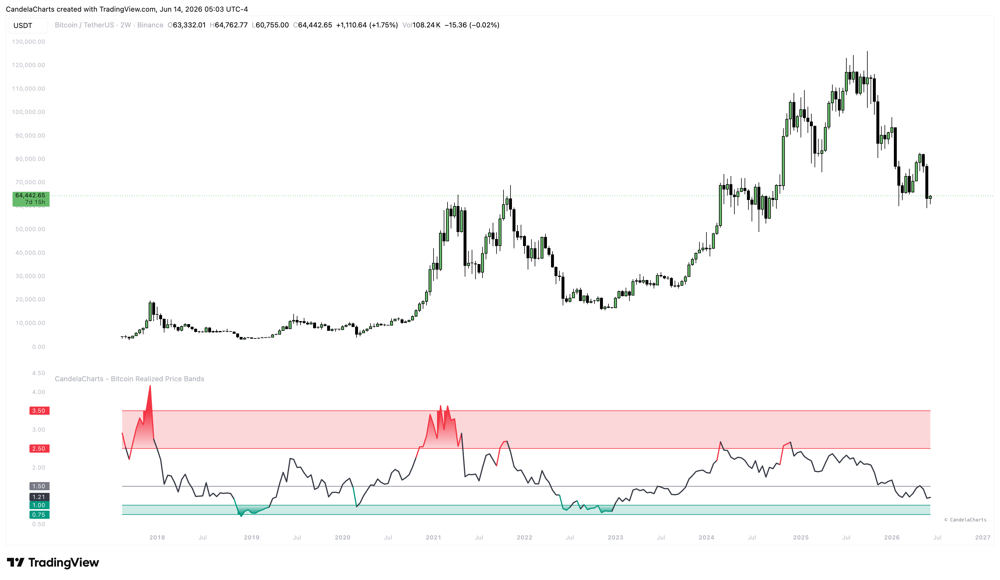

# Features

Leveraging on-chain Realized Cap data, this indicator maps out critical valuation extremes for Bitcoin.

<figure><figcaption></figcaption></figure>

Explore the automated signals and valuation bands that power this tool:

* **Realized Price Calculation**: Automatically fetches Bitcoin's Realized Market Cap and Divides it by Supply to calculate the true Realized Price.
* **Dynamic Valuation Bands**: Plots bands representing different multiples of the Realized Price (Lower Band, Mid Line, Overvalued, Extreme Bubble).
* **MVRV Oscillator**: Displays an oscillator representing the ratio of Current Price to Realized Price, highlighting cyclical tops and bottoms.
* **Automated Signals**: Generates clear Long and Short signals when the oscillator crosses key fundamental thresholds.
* **Candle Coloring**: Visually colors candles based on Bitcoin's valuation state (e.g., Undervalued, Neutral, Overvalued).
* **Background Highlights**: Emphasizes deep value zones and bubble territories directly on the chart background.
