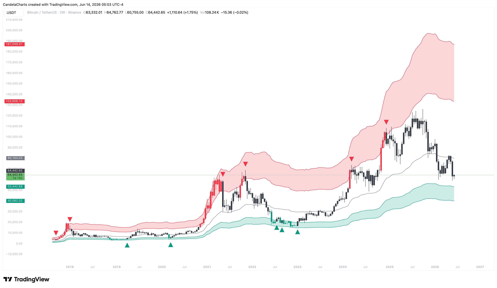

# Overview

This indicator goes beyond traditional technical analysis by utilizing on-chain data.&#x20;

<figure><figcaption></figcaption></figure>

It fetches Bitcoin's Realized Market Cap and divides it by the total circulating supply to calculate the true Realized Price—the average cost basis of all circulating coins.&#x20;


[features.md](features.md)



[usage.md](usage.md)



[confluences.md](confluences.md)



[faqs.md](faqs.md)


The indicator displays these valuation zones directly on the main price chart and includes a normalized MVRV (Market-Value-to-Realized-Value) ratio oscillator for a clearer view of historical extremes.
