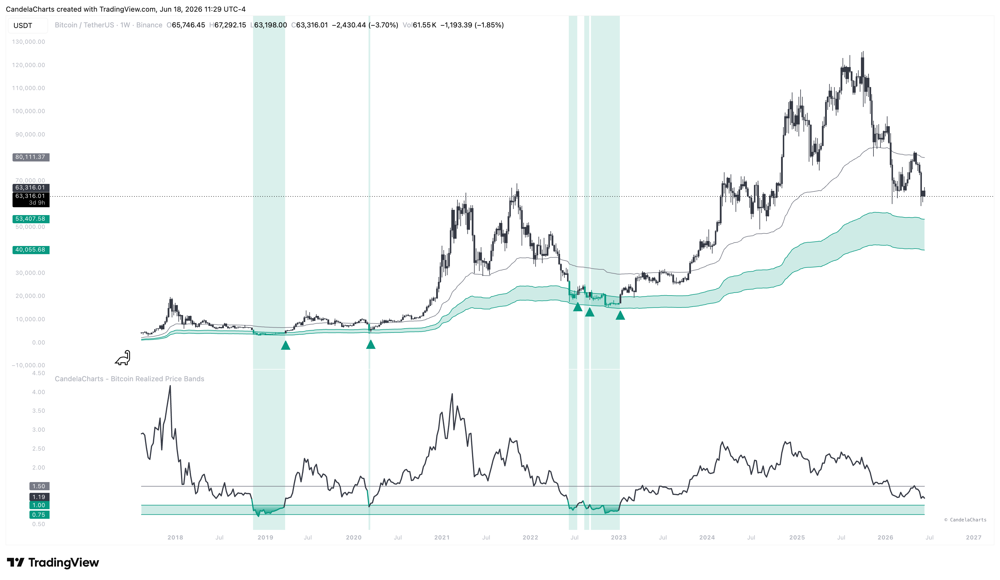
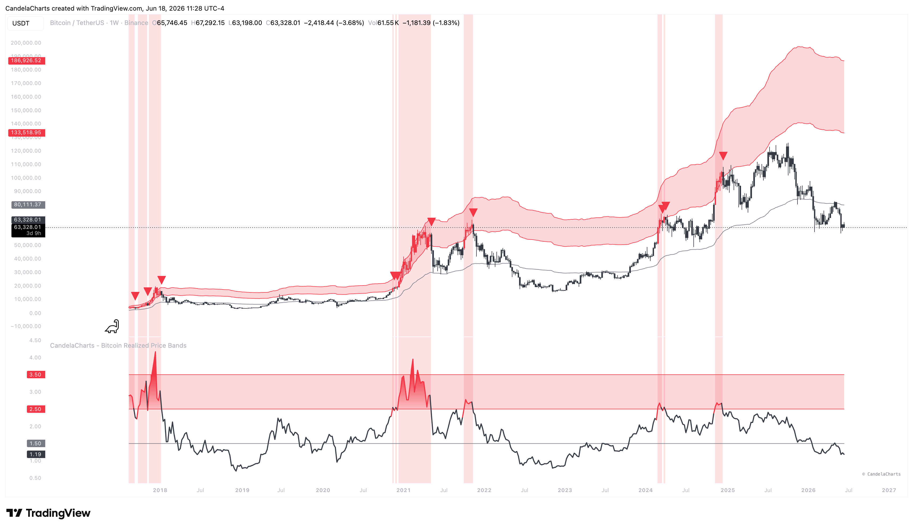

# Usage

Timing macro cycle tops and bottoms in Bitcoin is notoriously difficult. By comparing spot price against the Realized Price baseline, you can use these guidelines to execute long-term accumulation and distribution:

* **Accumulation**: Use the Lower Band and Realized Price levels to identify historic accumulation zones for long-term spot positions. When the price is below the Realized Price, the asset is historically undervalued.

<figure><figcaption></figcaption></figure>

* **Distribution**: Monitor the Overvalued and Extreme Bubble levels to gauge when the market is overheated and consider taking profits.

<figure><figcaption></figcaption></figure>

* **Timing with Signals**: Combine the built-in crossover signals with broader market context to time macro entries and exits effectively.
* **Macro Perspective**: Strip away short-term noise and evaluate Bitcoin's price relative to its fundamental on-chain cost basis.
