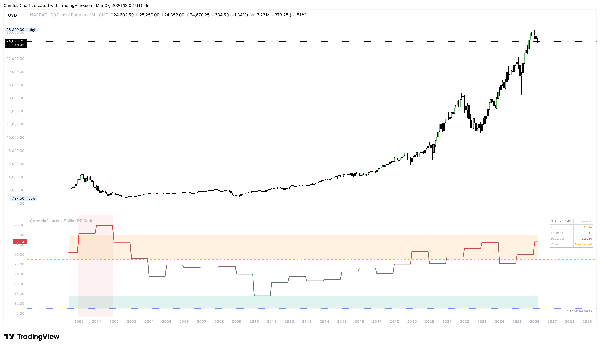

# Usage

<figure><figcaption></figcaption></figure>

Use the Shiller PE Ratio to move from tracking momentum to identifying generational value opportunities.

* **Generational Investing**: Identify buying opportunities when the ratio enters the **Extreme Undervalued** (Cyan/Blue) zones.
* **Risk Management**: Exercise caution or hedge positions when the ratio enters the **Extreme Overvalued** (Red) zone, as forward 10-year returns are historically lower from these levels.
* **Mean Reversion Trades**: Use the **Historical Mean** as a long-term target; markets that stretch too far from the mean often eventually revert.
* **Smoothing Analysis**: Adjust the smoothing input to filter out monthly noise and focus on the secular valuation trend.
