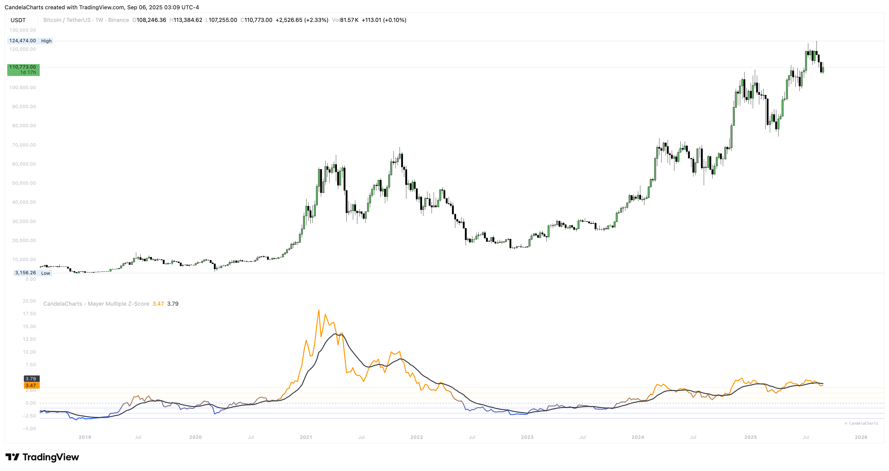

# Usage

<figure><figcaption></figcaption></figure>

Make decisions from a short checklist—trend, stretch, trigger.

* **Set baselines:** Start with SMA=200, Undervalue=0.5, Threshold=2.0, EMA=14; adjust thresholds by asset volatility.
* **Read the distribution:**
  * Inside **±1σ**: trend-following bias.
  * **+2..+3σ**: late-stage risk—trim/hedge unless momentum is accelerating.
  * **−3..−2σ**: value zone—wait for stabilization or EMA turn before scaling.
* **Trigger ideas:** Z-Score re-entering inside ±2σ after an extreme; EMA crossing 0; Z-Score crossing 0 for mean reversion.
* **Keep it comparable:** Avoid moving the 6σ span—tune the top/bottom multiples instead to preserve the scale across assets.
