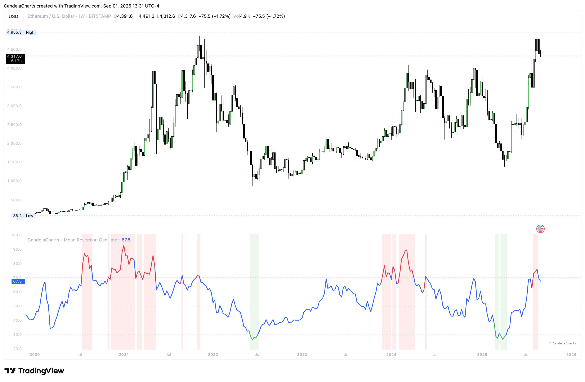

# Usage

<figure><figcaption></figcaption></figure>

The **Mean Reversion Oscillator (MRO)** is not meant to generate standalone buy or sell signals. Instead, it acts as a **contextual guide**, helping traders see when price is stretched away from its mean and when a reversion or momentum shift may be more likely.&#x20;

The **MRO** is best viewed as a **context indicator** that highlights when price is statistically stretched from its mean.

1. **Add to chart:** Paste the script in TradingView and load it in a separate pane.
2. **Set MA Length:** Use **20–50** for intraday, **100–200** for swing/position trading.
3. **Match StdDev Length:** Keep it close to the MA Length to avoid distortion (e.g., MA 200 → StdDev 200).
4. **Interpret readings:**
   * **>70 (Overbought):** Price stretched high, reversion or slowdown likely.
   * **<30 (Oversold):** Price stretched low, bounce potential.
   * **50 (Midline):** Neutral, momentum shift point.
5. **Use with confluence:** Strongest signals occur when MRO extremes align with **S/R levels, trend filters, or volume cues**.
6. **Adjust thresholds:** Default 70/30 is balanced; 80/20 gives fewer but stronger signals, 60/40 gives more but weaker ones.
7. **Stay trend-aware:** In strong trends, OB/OS can persist. Always check higher timeframe bias before fading moves.
