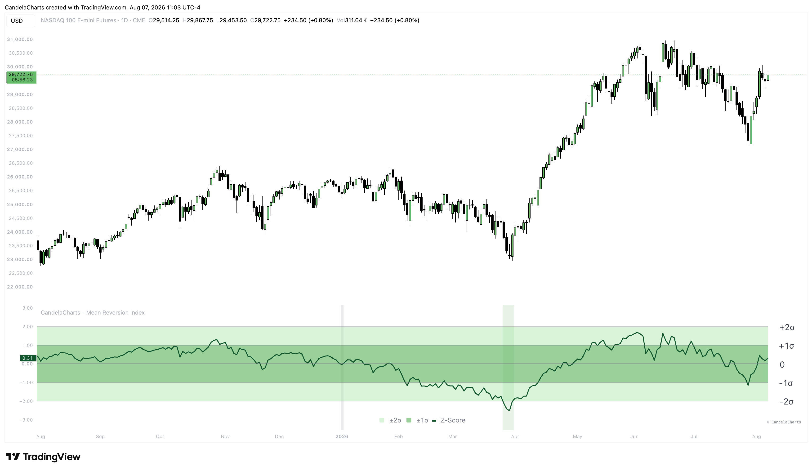

# Overview

<figure><figcaption></figcaption></figure>

The Mean Reversion Index strips away the noise of absolute price movements and focuses entirely on the "rubber band effect." It tracks how stretched the current price is relative to a baseline moving average (e.g., the 200-day SMA) compared to its historical behavior over the last several years.


[features.md](features.md)



[usage.md](usage.md)



[confluences.md](confluences.md)



[faqs.md](faqs.md)


When the oscillator spikes into the upper bounds, the asset is historically overextended to the upside, warning of a potential mean-reverting correction. Conversely, when the oscillator plunges into the lower bounds, the asset is experiencing extreme downside capitulation. These lower extremes often mark generational bottoms, which the indicator highlights dynamically as structural "Buy Zones."
