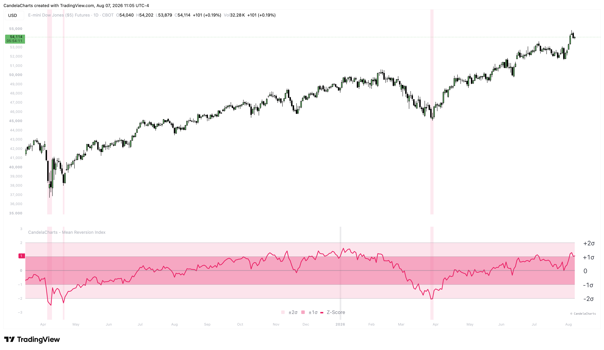

# Usage

<figure><figcaption></figcaption></figure>

The Mean Reversion Index is an essential tool for contrarian investors, swing traders, and those looking to build long-term positions near cyclical bottoms.

### How it works

The indicator first calculates a long-term baseline moving average (default 200-period SMA). It then measures the percentage distance between the current close and this baseline. To make this distance actionable across different market regimes, it computes a rolling Z-Score over a massive historical lookback (default 730 bars, roughly 2 years). This tells you exactly how many standard deviations the current extension is from the historical average. The final oscillator is then smoothed and plotted against standard deviation bands.

### Interpreting the Z-Score Levels

* **Euphoria Zone (Above +2σ)**: When the index breaches the +2σ line, the asset is historically overextended to the upside. The "rubber band" is stretched to its absolute limit, indicating high risk of a violent mean-reversion event to the downside. This is typically an area to take aggressive profits.
* **Fair Value (Between -1σ and +1σ)**: This is the neutral zone where the asset is trading reasonably close to its historical baseline. The majority of price action occurs here, representing balanced risk/reward.
* **Capitulation / Buy Zone (Below -2σ)**: When the index drops below the -2σ threshold, the asset has suffered a massive, statistically rare sell-off relative to its baseline. This indicates extreme fear and capitulation. The indicator highlights this area as a "Buy Zone," suggesting it is a prime area for long-term accumulation or contrarian long entries.
