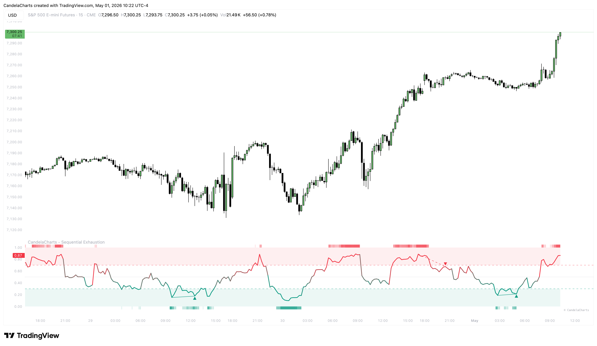

# Overview

The **Sequential Exhaustion** indicator is a high-precision oscillator inspired by the advanced technical methodologies of Tom DeMark. It is engineered to measure market demand by meticulously comparing intra-period price extremes to previous levels, providing traders with a sophisticated tool to identify overextended trends and imminent reversal points.

<figure><figcaption></figcaption></figure>

Unlike conventional oscillators that rely exclusively on closing prices, Sequential Exhaustion focuses on price action at the margins—the highs and lows. This makes it significantly more sensitive to true market exhaustion, filtering out noise and highlighting the moments where momentum is most likely to fail.

#### The Philosophy

At its core, Sequential Exhaustion operates on the principle that trends do not end when price stops moving, but when the _conviction_ behind the price movement is exhausted. By tracking the relationship between price extremes and volume-less demand, it identifies the "thinning" of a trend before the reversal actually occurs.


**Why Margins Matter:** By analyzing Highs and Lows rather than just Closes, the oscillator captures the full range of market participation, identifying "failed" pushes that Closes might miss.


#### Key Benefits

* **Anticipatory Signals**: Identifies exhaustion _before_ a trend change, rather than lagging behind it.
* **Momentum Context**: Provides a clear visual representation of market "heat" through the proprietary Momentum Radar.
* **Dual Sensitivity**: Combines raw price action with sophisticated smoothing to provide both responsive and reliable signals.
* **Clarity in Volatility**: Designed to remain legible and actionable even during high-volatility market events.

#### Market Applications

Sequential Exhaustion is highly effective across various market conditions:

* **Trend Reversals**: Catching the top or bottom of a sustained move.
* **Trend Exhaustion**: Identifying when a trend is losing steam and entering a consolidation phase.
* **Volatility Contraction**: spotting the quiet before the storm when the oscillator stays in the neutral zone.
