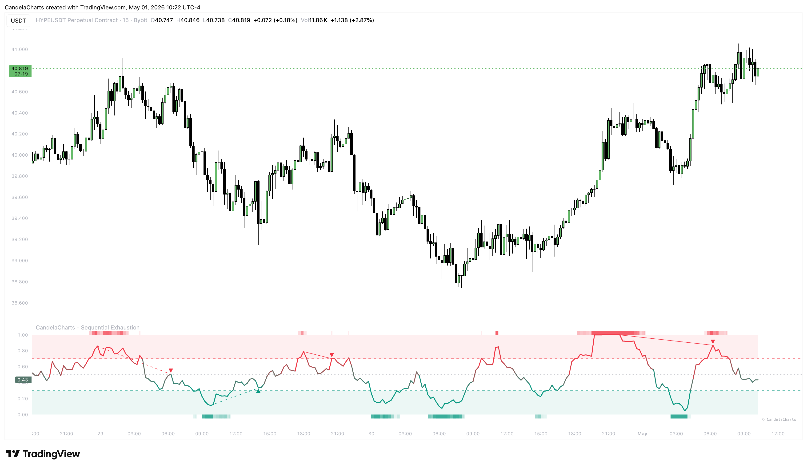

# Usage

Mastering the Sequential Exhaustion Oscillator requires understanding the interplay between its zones, its momentum, and its divergences.

<figure><figcaption></figcaption></figure>

#### 1. Overbought/Oversold Reversals

The primary use of the oscillator is identifying price extremes.

* **Sell Setup**: When the line enters the **0.7 zone**, wait for it to cross back _below_ 0.7. This confirms that the exhaustion has led to a shift in momentum.
* **Buy Setup**: When the line enters the **0.3 zone**, wait for it to cross back _above_ 0.3. This confirms the bottoming process is likely complete.

#### 2. Divergence Analysis

Divergences occur when the price makes a new extreme but the oscillator fails to do so.

* **Bullish Divergence**: Price makes a lower low, but the oscillator makes a higher low. Look for **Solid Lines** for the highest probability setups.
* **Bearish Divergence**: Price makes a higher high, but the oscillator makes a lower high.
* **Neutral Zone Divergences (Dashed Lines)**: Use these as warnings to tighten stops or take partial profits rather than immediate reversal entries.

#### 3. Regime Filtering (The 0.5 Level)

The midline (0.5) acts as a powerful trend separator.

* **Bullish Regime**: If the oscillator is consistently holding above 0.5, the trend is healthy. Pullbacks that hold the 0.5 level are often "buy the dip" opportunities.
* **Bearish Regime**: If the oscillator stays below 0.5, selling pressure is dominant. Rallies that fail at the 0.5 level are often "sell the rip" opportunities.

#### 4. Reading the Momentum Radar

The background "heat map" is your conviction gauge.

* **Low Intensity**: The oscillator is just entering the zone; the trend may still have room to run.
* **High Intensity (Opaque Background)**: The market is severely overextended. Expect a sharp, often violent, reversal or a deep correction.


**The "V" Reversal:** Look for sharp "V" shapes in the oscillator when it hits the Momentum Radar extremes. These often coincide with institutional "liquidity grabs" and provide excellent entry points.


#### Standard Workflow

1. **Identify the Regime**: Is the oscillator above or below 0.5?
2. **Check for Exhaustion**: Is the line in the 0.7 or 0.3 zone? Is the Momentum Radar intensifying?
3. **Wait for Confirmation**: Look for a Divergence signal or a cross-back into the Neutral Zone.
4. **Execute**: Align with price action (e.g., a candle engulfing pattern) for the final entry trigger.
