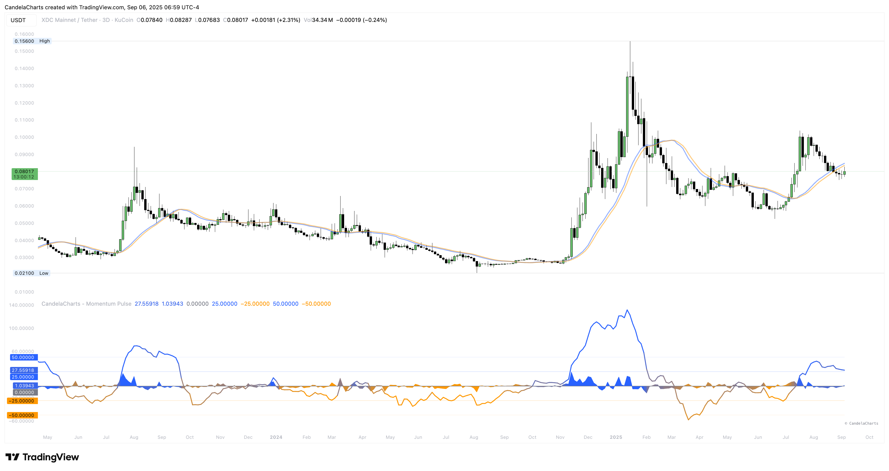

# Overview

<figure><figcaption></figcaption></figure>

A small set of rules makes momentum comparable across assets and timeframes.

The indicator builds a blended source (`src`), computes log momentum over a chosen length, colors it using an adaptive ±k·σ range, and optionally plots fixed bands (±L1/±L2) with fills.&#x20;


[features.md](features.md)



[usage.md](usage.md)



[confluences.md](confluences.md)



[faqs.md](faqs.md)


A zero-line separates regimes, and two context MAs help you judge signal vs. noise.
