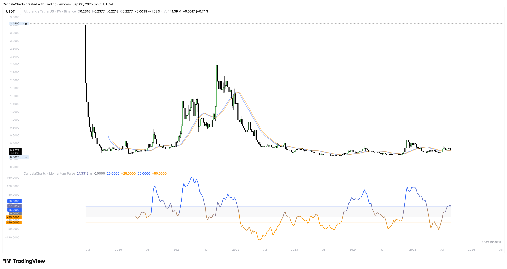

# Usage

<figure><figcaption></figcaption></figure>

Make it actionable with a repeatable flow: calibrate → read → decide.

**Reading & actions**

* **Regime:** Stay aligned with the side of 0 that dominates.
* **Impulses:** Entries on +L1 breaks in uptrends; take care near +L2 unless trend is accelerating.
* **Exits/hedges:** When momentum exits extreme zones back inside ±L2, look for mean reversion.
* **Tuning:** Increase Length for choppy names; adjust k/L1/L2 so that L2 only captures real thrust.
