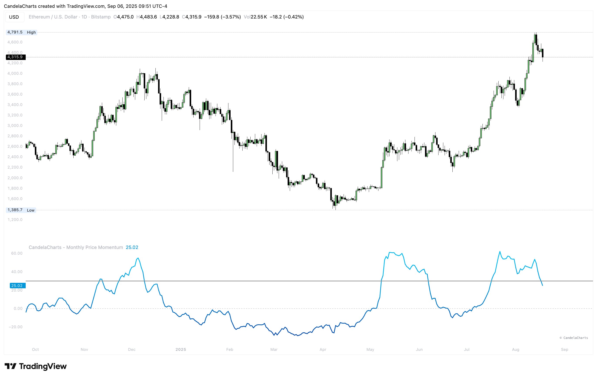

# Overview

<figure><figcaption></figcaption></figure>

The indicator computes **ROC% = (Close − Close\[n]) / Close\[n] · 100**, with `n` defaulting to **30 days** (one month on Daily).&#x20;


[features.md](features.md)



[usage.md](usage.md)



[confluences.md](confluences.md)



[faqs.md](faqs.md)


It then applies an **EMA smoothing** and plots two references: a **dashed 0 line** (regime) and a **solid upper level** (default **+30%**) to highlight powerful upside runs. A blue→cyan gradient encodes acceleration.
