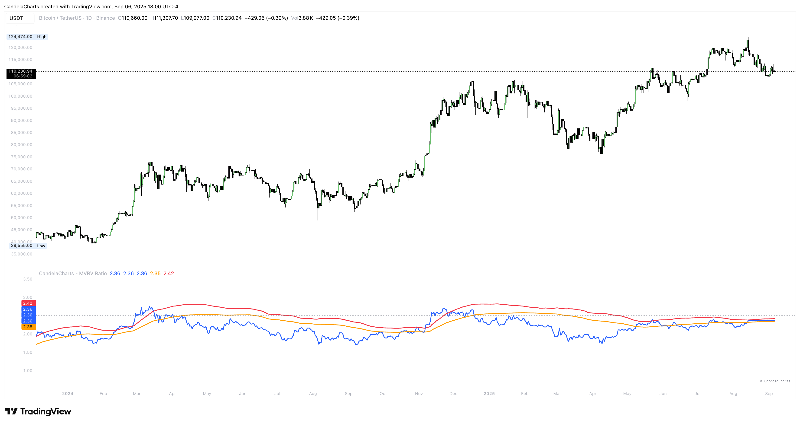

# Usage

<figure><figcaption></figcaption></figure>

Make MVRV actionable by pairing levels with structure and momentum.

* **Above 2.5:** Beware euphoria; seek confirmation before adding exposure and consider risk-reductions on weakness.
* **Around 1.0:** Watch for fair-value battles—recapture often coincides with regime turns.
* **Below 0.8:** Scan for accumulation signals (higher lows, funding normalization, breadth improvement).
* **With σ bands:** A push beyond +2σ followed by momentum rollover is a classic cool-down tell.
* **Asset nuance:** Read ETH relative to its own history; don’t assume BTC thresholds map 1:1.
