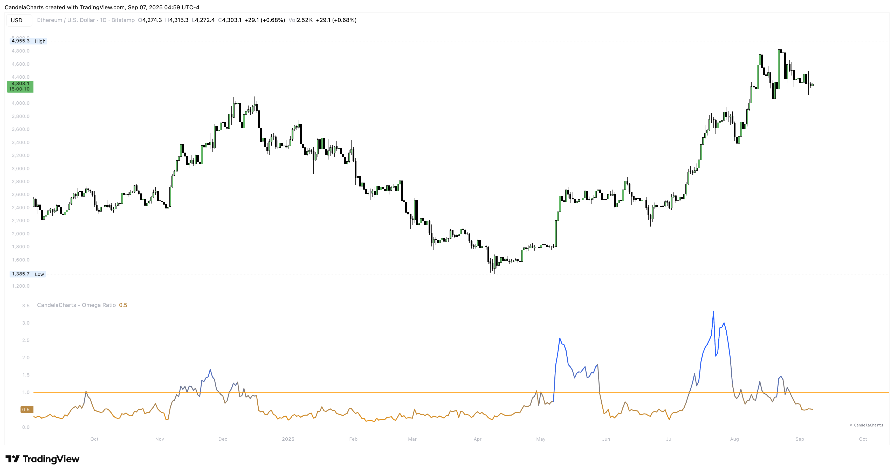

# Overview

<figure><figcaption></figcaption></figure>

Think of **Omega** as a fairness check: how often—and by how much—your returns beat the bar you’ve set versus how often they fall short.

* **Set your hurdle:** You choose a **Target Return per bar** (e.g., 0.05% daily).
* **Tally each bar:** When a bar clears the hurdle, we count how much it beat it by (“excess gain”); when it misses, we count the shortfall.
* **Roll it up:** Over your chosen window, the indicator compares **total wins vs. total misses**.
  * If wins outweigh misses, **Omega > 1** (quality is favorable).
  * If misses dominate, **Omega < 1** (quality is weak).
* **Choose the lens:** Use **linear returns** for steady markets or **log returns** for larger, jumpy moves and cross-asset comparisons.
* **Read it at a glance:** A gradient line conveys intensity, reference levels at **0.5 / 1.0 / 1.5 / 2.0** frame poor→strong regimes, and built-in alerts ping on crosses of **1.0** to flag shifts in quality.


[features.md](features.md)



[usage.md](usage.md)



[confluences.md](confluences.md)



[faqs.md](faqs.md)


Under the hood, the indicator turns your hurdle into a bar-by-bar test and scores how consistently price clears it.
