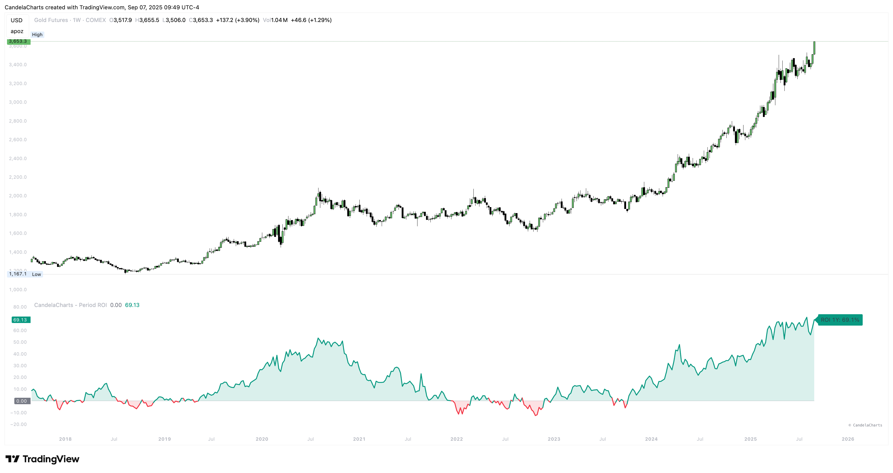

# Overview

<figure><figcaption></figcaption></figure>

A small set of choices gives you clear, comparable windowed returns.\
Pick a preset (1M/3M/6M/1Y) or set a custom number of days, choose the price source (Close by default), and the indicator plots the corresponding ROI% with a zero line and optional sign-based fills/background.&#x20;


[features.md](features.md)



[usage.md](usage.md)



[confluences.md](confluences.md)



[faqs.md](faqs.md)


A right-edge label can display the current ROI and the period tag (e.g., “ROI 1Y: +23.5%”).
