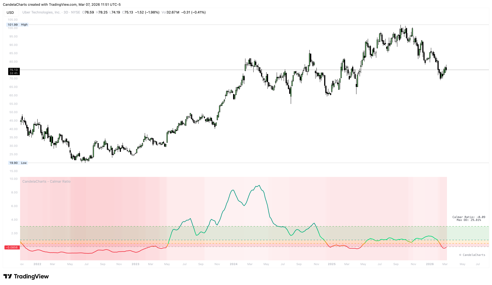

# Confluences

<figure><figcaption></figcaption></figure>

Strengthen your conviction by looking for the Calmar Ratio to align with these other trading signals.

* **Equity Curve Analysis**: Combine with your strategy's equity curve; a rising Calmar Ratio during an equity peak confirms robust growth.
* **Moving Average Alignment**: Look for signals where price is above a long-term MA while the Calmar Ratio is in the **Strong** or **Exceptional** zone.
* **Volatility Correlation**: Observe if high Calmar Ratios coincide with low volatility regimes, which often indicates sustainable institutional-grade trends.
* **Drawdown Recovery**: Use the ratio to identify assets that recover quickly from drawdowns, as these will maintain a higher Calmar value.
