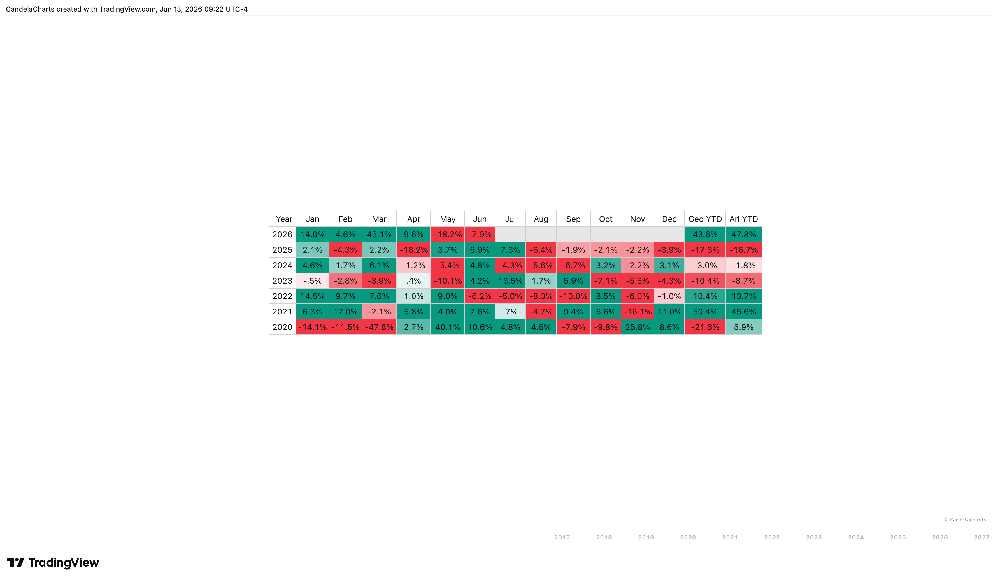

# Overview

Designed exclusively for the Monthly (1M) timeframe, the Monthly Returns Heatmap provides a comprehensive view of seasonal trends and long-term performance.&#x20;

<figure><figcaption></figcaption></figure>

It eliminates the need for manual data crunching by calculating and visualizing up to 30 years of historical monthly data directly on your TradingView chart.&#x20;


[features.md](features.md)



[usage.md](usage.md)



[confluences.md](confluences.md)



[faqs.md](faqs.md)


Whether you are looking to optimize your entry timing based on historical seasonality or simply want a macro perspective of an asset's historical behavior, this tool provides the necessary insights at a glance.
