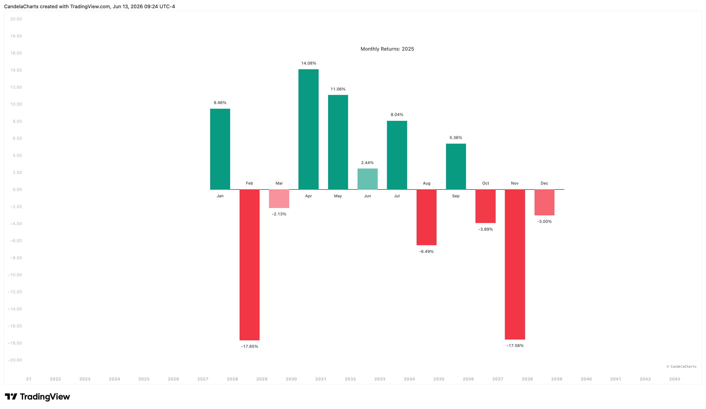

# Usage

<figure><figcaption></figcaption></figure>

To effectively identify seasonal patterns and optimize your entry timing based on historical data, follow these guidelines for using the Monthly Returns Heatmap:

1. **Set Timeframe**: Ensure your chart is set to the **1M (Monthly)** timeframe. A warning will appear on the chart if you are on a lower timeframe.
2. **Analyze Seasonality**: Use the Heatmap Table to spot recurring patterns across multiple years. For example, look for historically weak late-summer months or strong end-of-year rallies that repeat consistently.
3. **Deep Dive**: Switch the UI Mode to the Bar Chart and enter a specific Target Year in the settings. This allows you to visualize the month-by-month return distribution and magnitude for that specific historical period.
4. **Customize Colors**: Adjust the bullish and bearish base colors in the settings to match your personal chart theme or visual preferences.
