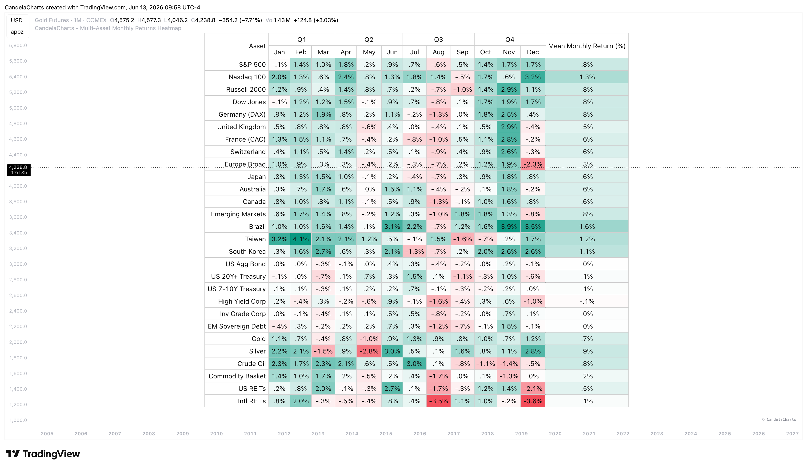
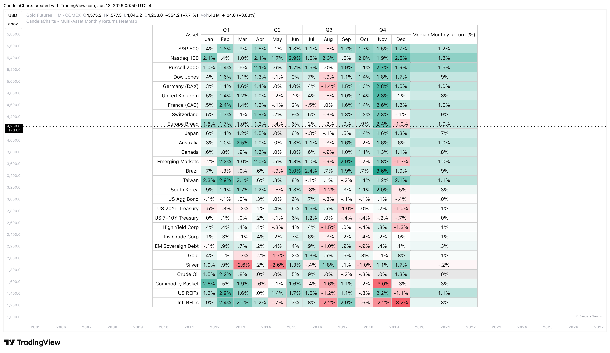
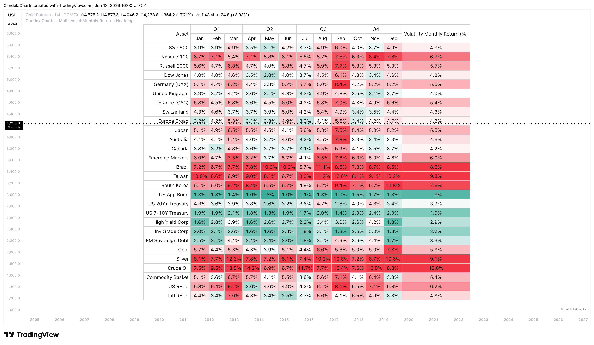
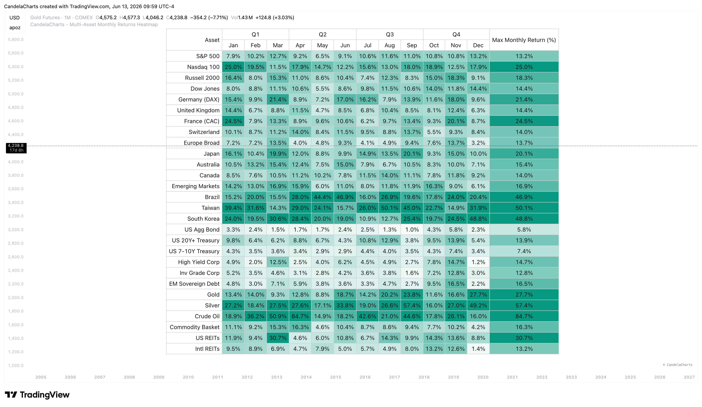
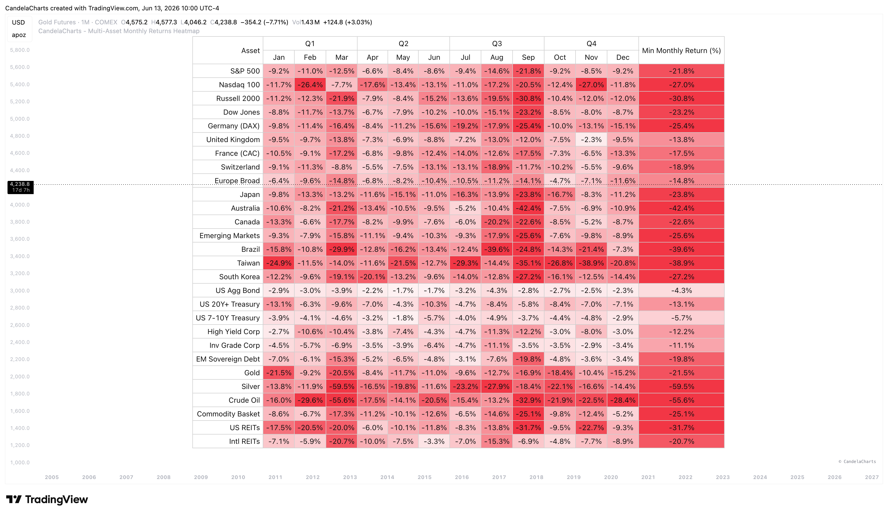
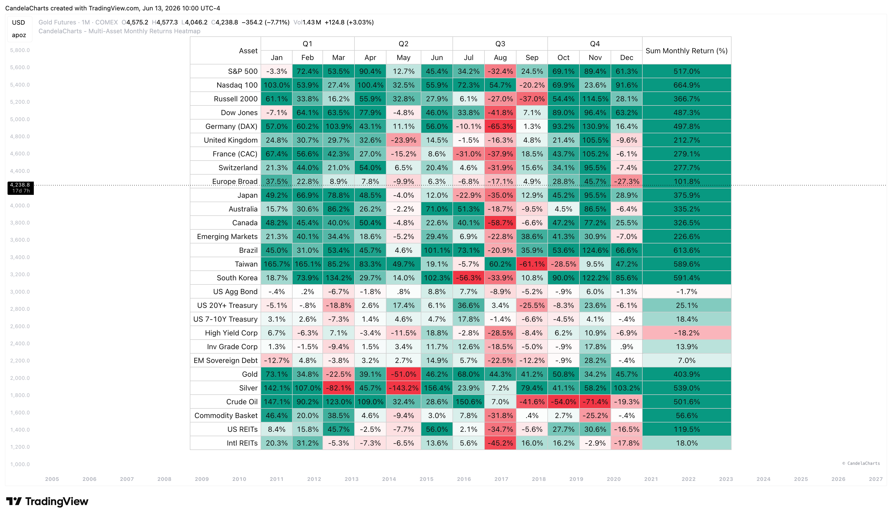

# Features

Built for macro investors and portfolio managers, this Multi-Asset Heatmap goes beyond simple price tracking by offering cross-market performance comparisons. Discover its key capabilities below:

* **Comprehensive Asset Tracking**: Analyze the performance of up to 28 different customizable assets simultaneously. The default list covers major equities, bonds, commodities, and REITs.
* **Quarterly Layout**: The heatmap table intelligently groups months into quarters (Q1-Q4) for easy visual segmentation and quarter-over-quarter analysis.
* **Dynamic Heatmap Scaling**: Fully customizable colors for bullish and bearish returns. The heatmap automatically scales its maximum color intensity bounds depending on the active Calc Mode (e.g., ±4% for Mean/Median, ±8% for Volatility, ±25% for Max/Min, and ±50% for Sum) to accurately highlight outliers.

#### Calculation Modes

The table automatically calculates and displays your chosen metric for each month per asset, dynamically updating the overall summary column. Select from the following modes:

**Mean**

Calculates the average historical return.

<figure><figcaption></figcaption></figure>

**Median**

Calculates the median historical return, helping to filter out extreme outliers.

<figure><figcaption></figcaption></figure>

**Volatility**

Measures the historical volatility (risk) of returns for that month.

<figure><figcaption></figcaption></figure>

**Max**

Shows the single highest positive return historically recorded.

<figure><figcaption></figcaption></figure>

**Min**

Shows the single lowest negative return historically recorded.

<figure><figcaption></figcaption></figure>

**Sum**

Calculates the cumulative total of all historical returns.

<figure><figcaption></figcaption></figure>
