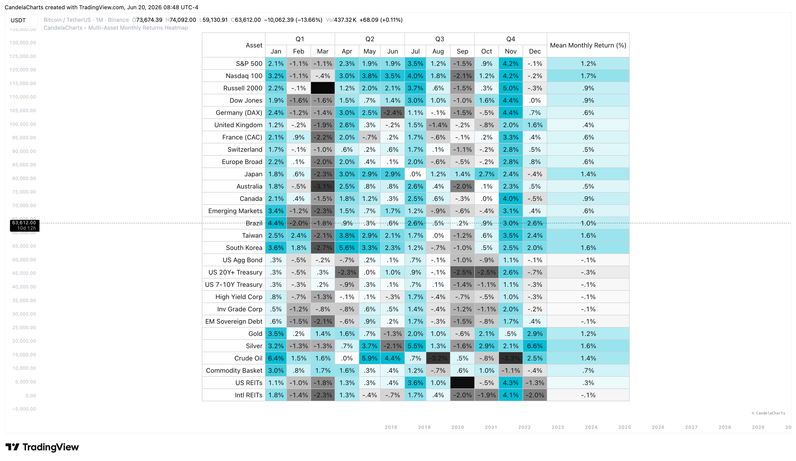

# Overview

Operating on the Monthly (1M) timeframe, this heatmap allows you to analyze the average historical performance of up to 28 different customizable assets at once.&#x20;

<figure><figcaption></figcaption></figure>

It goes beyond simple returns by offering multiple statistical calculation modes—including Mean, Median, Volatility, Max, Min, and Sum.&#x20;


[features.md](features.md)



[usage.md](usage.md)



[confluences.md](confluences.md)



[faqs.md](faqs.md)


This makes it an indispensable tool for identifying cross-market seasonal trends, benchmarking performance, and conducting deep statistical analysis across equities, bonds, commodities, and other asset classes.
