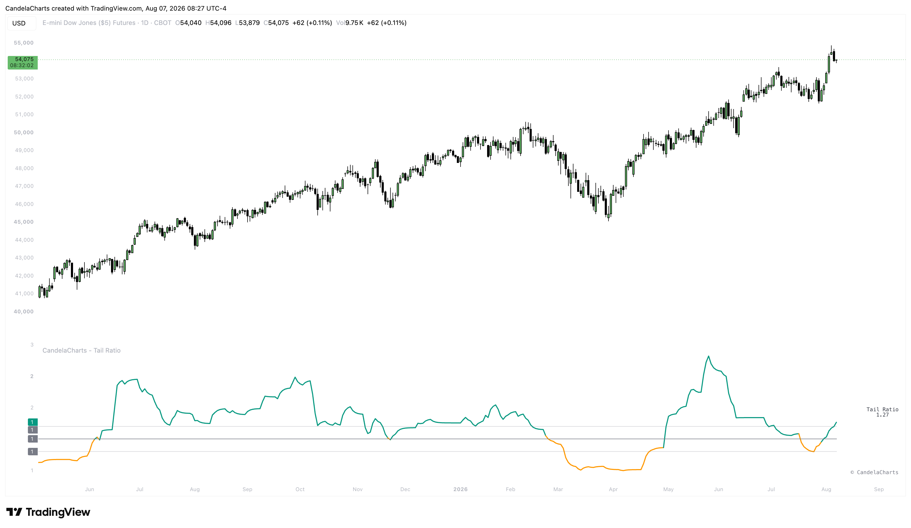

# Overview

<figure><figcaption></figcaption></figure>

The Tail Ratio compares the magnitude of extreme positive returns (the right tail) to the magnitude of extreme negative returns (the left tail) over a specified lookback period.


[features.md](features.md)



[usage.md](usage.md)



[confluences.md](confluences.md)



[faqs.md](faqs.md)


Instead of treating all volatility as equal, the indicator parses out the direction of the extremes. When the ratio is high, it indicates that the asset's largest gains are significantly larger than its largest losses. Conversely, a low ratio indicates that the asset's largest losses are overpowering its gains. By visualizing this ratio, you can easily determine the underlying structural bias of the current market environment.
