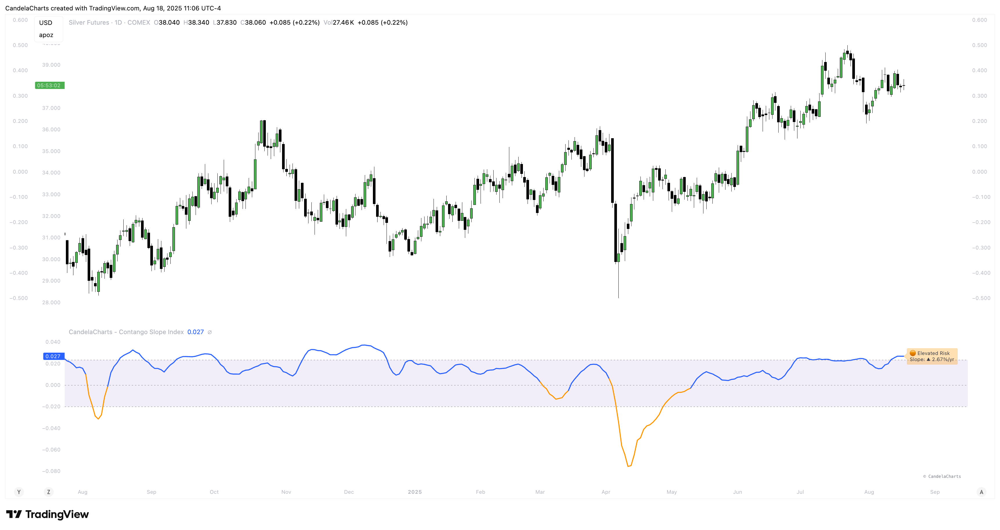

# Overview

<figure><figcaption></figcaption></figure>

The **Contango Slope Index (CSI)** is a volatility term structure analysis tool designed to quantify the slope of the VIX futures curve over time.&#x20;

By measuring the rate of change in implied volatility across multiple tenors—such as VIX1D, VIX (1M), VIX3M, VIX6M, and VIX1Y—the CSI provides traders and analysts with real-time insights into market sentiment, risk appetite, and potential turning points in equity markets.

Developed by CandelaCharts, the CSI draws from established financial research on volatility term structures, particularly focusing on how **contango** (upward-sloping curve) and **backwardation** (downward-sloping curve) regimes correlate with future market behavior.&#x20;

The index computes a normalized slope using linear regression across available VIX futures, offering a dynamic view of evolving market expectations.

The core output—a slope value expressed in annualized percentage points per year (%/yr)—represents the steepness of the volatility curve:

* **Positive slope**: Contango regime, typically associated with market stability and complacency.
* **Negative slope**: Backwardation, historically linked to fear, near-term uncertainty, and often preceding market rallies.
* **Slope crossing zero or key thresholds**: Generates regime shifts and alert conditions.


[features.md](features.md)



[usage.md](usage.md)



[confluences.md](confluences.md)



[faqs.md](faqs.md)


The CSI also includes moving average smoothing, regime classification, and background coloring to enhance interpretability and integration into tactical decision-making frameworks.
