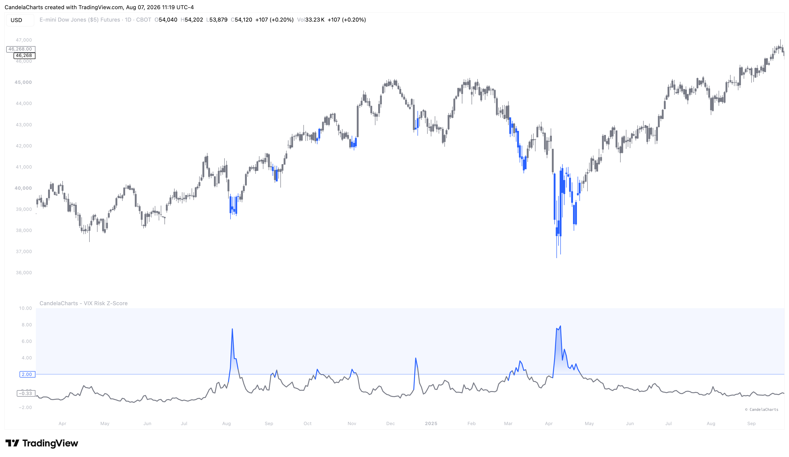

# Overview

<figure><figcaption></figcaption></figure>

Rather than trading off the raw value of the VIX, the VIX Risk Z-Score evaluates how far the current VIX reading has deviated from its long-term average. It calculates this deviation in terms of standard deviations (Z-Scores).


[features.md](features.md)



[usage.md](usage.md)



[confluences.md](confluences.md)



[faqs.md](faqs.md)


When the VIX spikes violently, driving the Z-Score above the upper threshold, it signals extreme market panic and fear. Paradoxically, these moments of peak fear often align with major structural market bottoms. Conversely, when the VIX grinds lower for an extended period, pushing the Z-Score into deep negative territory, it signals maximum market complacency—a warning sign that risk is underpriced and a sudden shock could be imminent.
