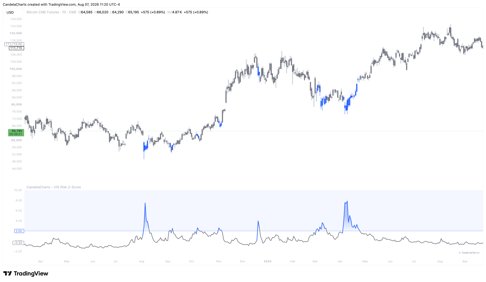

# Usage

<figure><figcaption></figcaption></figure>

The VIX Risk Z-Score is a crucial tool for contrarian investing, allowing you to systematically buy when there is "blood in the streets" and exercise caution when markets become overly euphoric.

### How it works

The indicator pulls daily VIX closing data directly from the Federal Reserve Economic Data (FRED) database. It calculates a long-term moving average and standard deviation (defaulting to a 365-day lookback). It then computes the Z-Score, measuring exactly how many standard deviations the current VIX is from its mean. The resulting oscillator and candle overlays visually alert you when volatility reaches extreme statistical tails.

### Interpreting the Regimes

* **Overbought / Panic (Z-Score > 2.0)**: When the VIX spikes and pushes the Z-Score above the +2.0 threshold, the market is experiencing intense fear and panic selling. The indicator highlights this by coloring the candles and the oscillator (default Blue). These periods are historically the most lucrative times to aggressively buy the dip in risk assets, as fear has peaked.
* **Neutral (Z-Score between -2.0 and 2.0)**: The VIX is trading within its normal historical bounds. Volatility is behaving as expected, and traditional trend-following strategies tend to work best here (default Gray candles).
* **Oversold / Complacency (Z-Score < -2.0)**: When the VIX grinds extremely low and pushes the Z-Score below the -2.0 threshold, the market is deeply complacent. Investors are pricing in zero risk. The indicator highlights this (default Orange). While markets can remain complacent for long periods, this reading warns you to tighten stop-losses, avoid using excessive leverage, and prepare for a potential volatility spike.
