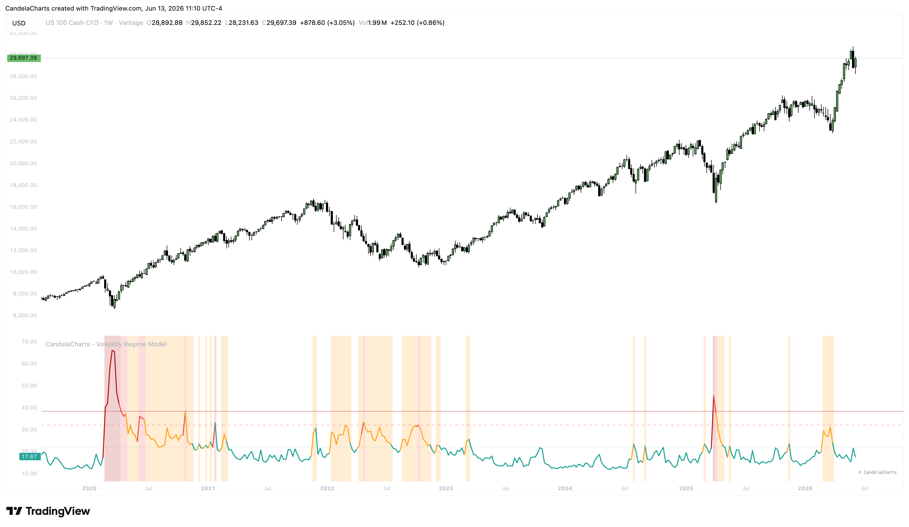

# Overview

Volatility is approached as a series of regimes, not as absolute levels.&#x20;

<figure><figcaption></figcaption></figure>

This framework identifies, validates, and executes transitions between market states.&#x20;


[features.md](features.md)



[usage.md](usage.md)



[confluences.md](confluences.md)



[faqs.md](faqs.md)


By utilizing the VIX index, measuring the persistence of volatility shocks, and validating with the MOVE Index (bond volatility) and High-Yield Credit Spreads, the model categorizes market conditions into four distinct states: Low Vol (Stable), Mid Vol (Fragile), High Vol (Stress), and Crisis Cluster.
