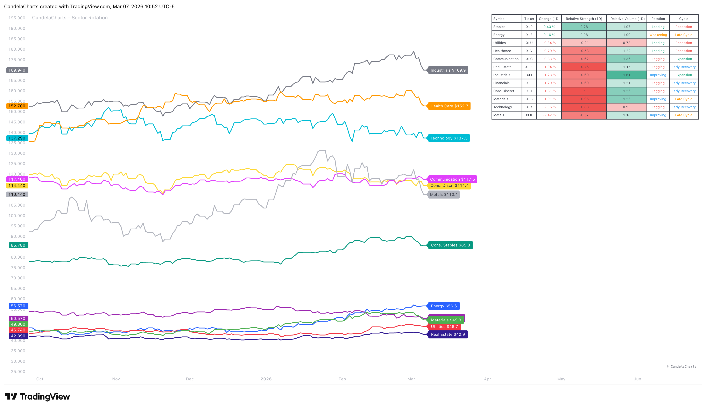

# Overview

<figure><figcaption></figcaption></figure>

The **CandelaCharts – Sector Rotation Map** is a strategic analysis tool designed to track capital flow across the major sectors of the US economy.&#x20;

By monitoring relative performance and volume, it helps investors identify which market segments are leading, weakening, lagging, or improving.&#x20;


[features.md](features.md)



[usage.md](usage.md)



[confluences.md](confluences.md)



[faqs.md](faqs.md)


This bird’s-eye view is essential for aligning portfolios with the current stage of the economic cycle.
