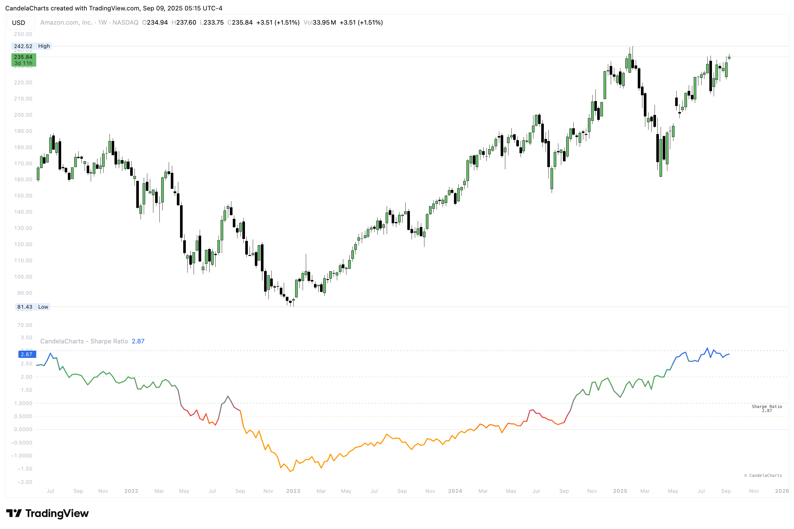

# Usage

<figure><figcaption></figcaption></figure>

Turn Sharpe into a practical gate and sizing tool.

**Quick start**

1. Pick a **calculation TF** (leave blank to use the chart).
2. Set **Lookback** (e.g., 126), **Periods/Year** (252 for daily), and **Risk-free (annual %)**.
3. Keep **Use log returns** on for most assets; turn off for steady names.
4. Enable **Annualize** to compare across markets and managers.

**Playbook**

* **Filter:** Prefer longs while Sharpe ≥ 1; avoid fresh risk when < 0.
* **Size:** Scale positions with the level and stability of Sharpe.
* **Compare:** Use the same settings across a watchlist to rank quality quickly.
* **Adapt:** If readings are noisy, raise lookback or add a small EMA; if too sluggish, do the opposite.
