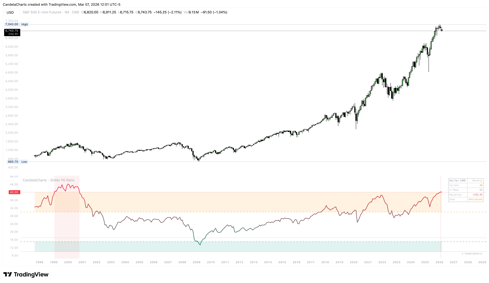

# Overview

<figure><figcaption></figcaption></figure>

The **CandelaCharts – Shiller PE Ratio** (also known as the Cyclically Adjusted Price-to-Earnings Ratio or CAPE) is a powerful valuation metric designed to identify long-term market bubbles and buying opportunities.&#x20;


[features.md](features.md)



[features.md](features.md)



[usage.md](usage.md)



[confluences.md](confluences.md)



[faqs.md](faqs.md)


By using 10 years of inflation-adjusted earnings, it filters out short-term economic fluctuations to provide a clear picture of whether the market is fundamentally expensive or cheap.
