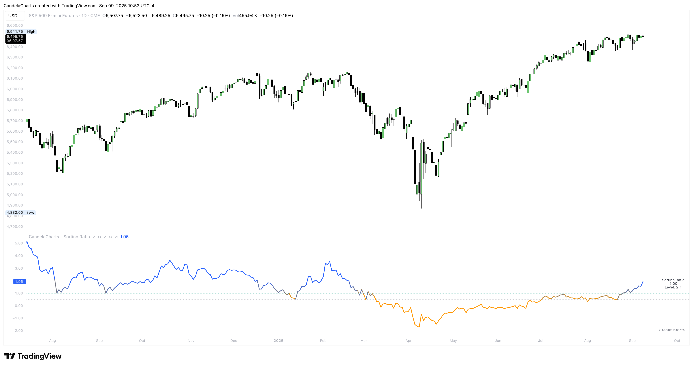

# Usage

<figure><figcaption></figcaption></figure>

Make Sortino your quality gate, then apply your playbook.

**Interpretation guidelines** (industry-style)

* **< 0** — Worse than risk-free.
* **0 – 0.5** — Poor / suboptimal.
* **0.5 – 1.0** — Marginal / mediocre.
* **1.0 – 1.99** — Good (often “investable”).
* **2.0 – 2.99** — Very good / excellent.
* **≥ 3.0** — Exceptional (rare; often not durable).

_Legend:_ **1+ good • 2+ very good • 3+ exceptional • <0 worse than risk-free.**
