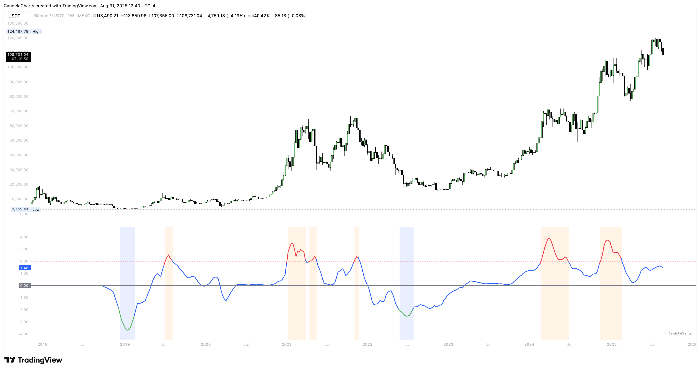

# Overview

<figure><figcaption></figcaption></figure>

The Vertex Oscillator is a proprietary momentum-based oscillator designed to detect periods of deep undervaluation (accumulation) and excessive euphoria (distribution) in markets.

By combining price deviation, volume normalization, and volatility scaling, the indicator identifies extreme conditions and provides actionable signals for both traders and analysts.

The Vertex Oscillator helps traders identify undervaluation, euphoria, and neutral market states. Beyond zone signals, it can also be used to spot bullish or bearish divergences between price and momentum.
