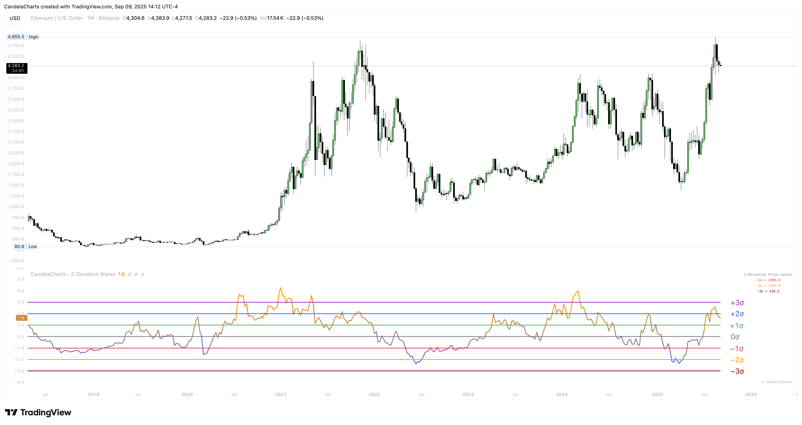

# Usage

<figure><figcaption></figcaption></figure>

When σ becomes a habit, entries/exits feel less like hunches and more like process.

**Quick start**

1. Set **Period = 50**, **Label Mode = Z-score (σ)**, **Smoothing = 1**.
2. Watch how price behaves at **±1σ / ±2σ / ±3σ** for a few cycles.
3. Switch to **Price @ σ** once you’re ready to turn context into orders/alerts.
4. If the wave chatters, try **Smoothing = 3–5**.

**What the tiers usually imply** _(not probabilities; just practical heuristics)_

* **±1σ:** everyday noise; don’t overreact.
* **±2σ:** meaningful stretch; prepare for exhaustion _or_ power trend continuation.
* **±3σ:** rare extreme; either blow-off risk or a high-energy reversal area—manage size.

**Two playbooks**

* **Mean-reversion**
  * Wait for a tag of **+2σ/+3σ** (or **−2σ/−3σ**).
  * Look for **trend columns** to stall or flip, then use structure (candle trigger/HTF level).
  * Target the **0σ** or **±1σ** area; trail to stay sensible if it keeps running.
* **Trend continuation**
  * In strong uptrends, pullbacks that **hold 0σ/−1σ** often become add-points.
  * In downtrends, rallies stalling at **0σ/+1σ** are risk-defined short zones.
  * Smoothing = **2–3** can reduce false flips without much lag.

**Copy-and-paste presets**

* **Baseline σ framing:** Z-score (σ), Period 50, Smoothing 1, Trend Columns ON, Downside Table ON.
* **Tradable levels:** Price @ σ, Period 50, Smoothing 3, Downside Table ON (set alerts at −1σ/−2σ/−3σ).
* **Presentation grid:** Price @ Z, Period 50, Smoothing 3 (uniform spacing across tickers).
* **Fast vs. slow window:** Panel A Period 20; Panel B Period 100 on the same symbol.
* **Smoothing contrast:** Smoothing 1 vs. 5 on the same chart.
* **Timeframe contrast:** Same preset on 5-minute and Daily; consider a longer Period for intraday.

**Tuning tips**

* **Period:** shorter (20–30) = faster & noisier; longer (80–100) = steadier & rarer extremes.
* **Source:** `close` is crisp; `hl2`/`hlc3` can tame erratic feeds.
* **Smoothing:** keep it modest (2–5) to reduce chatter without blinding turns.
