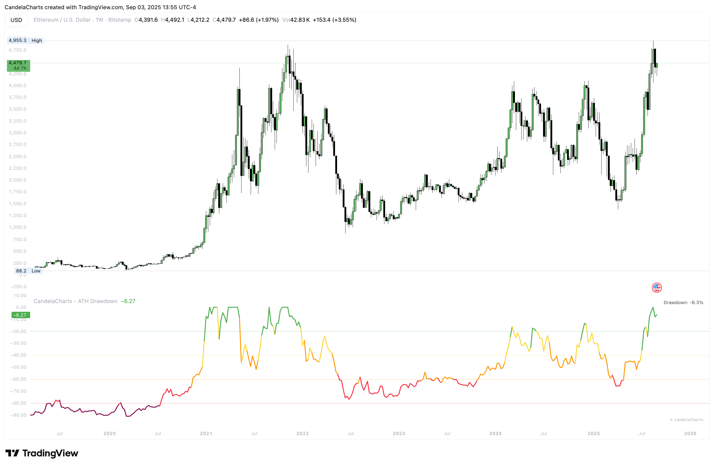

# Overview

<figure><figcaption></figcaption></figure>

CandelaCharts — ATH Drawdown measures how far price sits from its All-Time High in real time, plotting percent drawdown from a running ATH—0% at the peak, negative below—to support cycle analysis, risk framing, systematic DCA, and capitulation-zone detection across any asset and timeframe.


[features.md](features.md)



[usage.md](usage.md)



[confluences.md](confluences.md)



[faqs.md](faqs.md)


In short, CandelaCharts — ATH Drawdown gives you an objective, always-on gauge of cycle depth so you can time accumulation, manage risk, and compare assets with conviction.
